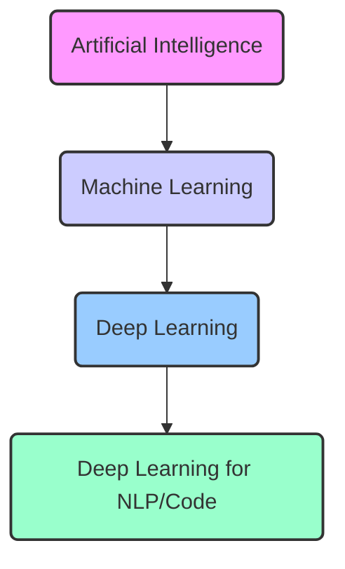

# Deep Learning for Natural Language and Code

**A Comprehensive Guide Based on University Course Materials**

**(Originally Presented by Prof. Dr. Steffen Herbold, Jonathan Drechsel, and Anamaria Mojica-Hanke, University of Passau)**

---

## Preface

Welcome to "Deep Learning for Natural Language and Code"! This book aims to provide a thorough introduction to the exciting intersection of deep learning (DL), natural language processing (NLP), and software code analysis. Derived from university lecture materials, it offers a structured journey from fundamental concepts to the state-of-the-art transformer architecture and its applications.

The fields of NLP and code analysis have been revolutionized by deep learning. Models can now understand, generate, and reason about text and code with unprecedented accuracy, powering applications like machine translation, chatbots, code completion, bug detection, and much more. This book will equip you with the foundational knowledge and practical understanding needed to navigate this rapidly evolving landscape.

**Who is this book for?**

This book is designed for:

*   University students in computer science, data science, or related fields taking a course on NLP or DL.
*   Software engineers and data scientists looking to apply deep learning techniques to text or code data.
*   Researchers seeking a consolidated overview of foundational DL techniques for NLP and code.
*   Anyone curious about how modern AI like ChatGPT, Co-Pilot, or advanced translation services work under the hood.

**Prerequisites:**

*   **Solid Programming Skills:** Familiarity with Python is essential, as examples and exercises will primarily use Python and associated libraries (like PyTorch or TensorFlow).
*   **Machine Learning Fundamentals:** A basic understanding of machine learning concepts (training, testing, validation, supervised/unsupervised learning, classification, regression) is assumed.
*   **Deep Learning Basics:** Prior exposure to neural networks (neurons, layers, activation functions, backpropagation, gradient descent) is highly beneficial. Chapter 1 provides a refresher, but it's concise.
*   **Mathematics:** Comfort with linear algebra, calculus (derivatives/gradients), and basic probability theory is necessary to grasp the underlying mechanisms.
*   **NLP Basics (Helpful but not Required):** Prior knowledge of NLP concepts (like linguistics basics) is helpful but not strictly necessary, as key ideas will be introduced.

**How to Use This Book:**

Each chapter builds upon the previous ones. We recommend reading them sequentially.

*   **Learning Objectives:** Start each chapter by reviewing the learning objectives to understand the key takeaways.
*   **Content:** Engage with the explanations, diagrams (visualize the concepts!), and examples. Pay close attention to the mathematical formulations where provided.
*   **Code Snippets:** Study the conceptual code examples to see how theories translate into practice.
*   **Check Your Understanding:** Pause at these questions to test your grasp of the material just covered.
*   **Chapter Summary:** Review the key points at the end of each chapter to reinforce your learning.
*   **Exercises & Mini-Projects:** Actively work through the exercises and attempt the mini-projects. This hands-on practice is crucial for solidifying understanding.
*   **Further Reading & Resources:** Explore the suggested resources to delve deeper into specific topics.

**Our Goal:**

Our aim is not just to present information but to foster understanding and inspire further exploration. We hope this book serves as a valuable resource in your journey into the fascinating world of deep learning for natural language and code.

Let's begin!

---

## Table of Contents

*   [Preface](#preface)
*   [Chapter 1: Introduction and Foundations](#chapter-1-introduction-and-foundations)
    *   [Learning Objectives](#learning-objectives)
    *   [1.1 Why Study Deep Learning for NLP and Code?](#11-why-study-deep-learning-for-nlp-and-code)
    *   [1.2 Motivating Examples](#12-motivating-examples)
        *   [1.2.1 Large Language Models (LLMs)](#121-large-language-models-llms)
        *   [1.2.2 Text Summarization](#122-text-summarization)
        *   [1.2.3 Machine Translation](#123-machine-translation)
        *   [1.2.4 Code Generation (GitHub Copilot)](#124-code-generation-github-copilot)
    *   [1.3 Basic Definitions](#13-basic-definitions)
        *   [1.3.1 Natural Language Processing (NLP)](#131-natural-language-processing-nlp)
        *   [1.3.2 Levels of Linguistic Analysis](#132-levels-of-linguistic-analysis)
        *   [1.3.3 NLP, NLU, and NLG](#133-nlp-nlu-and-nlg)
        *   [1.3.4 Artificial Intelligence (AI)](#134-artificial-intelligence-ai)
        *   [1.3.5 Machine Learning (ML)](#135-machine-learning-ml)
        *   [1.3.6 Neural Networks (NN)](#136-neural-networks-nn)
        *   [1.3.7 Relationships Between Concepts](#137-relationships-between-concepts)
    *   [1.4 A (Very) Brief Introduction to Deep Learning](#14-a-very-brief-introduction-to-deep-learning)
        *   [1.4.1 The Perceptron and Multi-Layer Perceptrons (MLPs)](#141-the-perceptron-and-multi-layer-perceptrons-mlps)
        *   [1.4.2 Activation Functions](#142-activation-functions)
        *   [1.4.3 Loss Functions](#143-loss-functions)
        *   [1.4.4 Training Neural Networks: Backpropagation and Gradient Descent](#144-training-neural-networks-backpropagation-and-gradient-descent)
        *   [1.4.5 Optimization Algorithms (SGD, Adam)](#145-optimization-algorithms-sgd-adam)
        *   [1.4.6 Regularization (L2, Dropout, Early Stopping)](#146-regularization-l2-dropout-early-stopping)
        *   [1.4.7 Normalization Layers](#147-normalization-layers)
        *   [1.4.8 Convolutional Neural Networks (CNNs)](#148-convolutional-neural-networks-cnns)
        *   [1.4.9 Recurrent Neural Networks (RNNs)](#149-recurrent-neural-networks-rnns)
        *   [1.4.10 Residual Connections (Skip Connections)](#1410-residual-connections-skip-connections)
    *   [1.5 Language Models: A Foundation](#15-language-models-a-foundation)
        *   [1.5.1 Grammar-Based Language Models](#151-grammar-based-language-models)
        *   [1.5.2 Stochastic Language Models](#152-stochastic-language-models)
        *   [1.5.3 Markov Models and N-Grams](#153-markov-models-and-n-grams)
        *   [1.5.4 The Challenge of Scale: Why N-Grams Aren't Enough](#154-the-challenge-of-scale-why-n-grams-arent-enough)
        *   [1.5.5 Neural Language Models: The Path Forward](#155-neural-language-models-the-path-forward)
    *   [1.6 Roadmap: Towards Large Language Models](#16-roadmap-towards-large-language-models)
    *   [1.7 Chapter Summary](#17-chapter-summary)
    *   [1.8 Check Your Understanding & Exercises](#18-check-your-understanding--exercises)
    *   [1.9 Further Reading & Resources](#19-further-reading--resources)
*   [Chapter 2: NLP Tasks and Benchmarks](#chapter-2-nlp-tasks-and-benchmarks)
    *   [Learning Objectives](#learning-objectives-1)
    *   [2.1 A Landscape of NLP Tasks](#21-a-landscape-of-nlp-tasks)
    *   [2.2 Common Solution Strategies](#22-common-solution-strategies)
        *   [2.2.1 Classification](#221-classification)
        *   [2.2.2 Natural Language Generation (NLG)](#222-natural-language-generation-nlg)
        *   [2.2.3 Span Detection](#223-span-detection)
        *   [2.2.4 Combining Strategies](#224-combining-strategies)
    *   [2.3 Evaluating Progress: Benchmarks](#23-evaluating-progress-benchmarks)
    *   [2.4 GLUE: General Language Understanding Evaluation](#24-glue-general-language-understanding-evaluation)
        *   [2.4.1 CoLA: Corpus of Linguistic Acceptability](#241-cola-corpus-of-linguistic-acceptability)
        *   [2.4.2 SST-2: Stanford Sentiment Treebank](#242-sst-2-stanford-sentiment-treebank)
        *   [2.4.3 MRPC: Microsoft Research Paraphrase Corpus](#243-mrpc-microsoft-research-paraphrase-corpus)
        *   [2.4.4 STS-B: Semantic Textual Similarity Benchmark](#244-sts-b-semantic-textual-similarity-benchmark)
        *   [2.4.5 QQP: Quora Question Pairs](#245-qqp-quora-question-pairs)
        *   [2.4.6 MNLI: Multi-Genre Natural Language Inference](#246-mnli-multi-genre-natural-language-inference)
        *   [2.4.7 QNLI: Question Natural Language Inference](#247-qnli-question-natural-language-inference)
        *   [2.4.8 RTE: Recognizing Textual Entailment](#248-rte-recognizing-textual-entailment)
        *   [2.4.9 WNLI: Winograd NLI Schema Challenge](#249-wnli-winograd-nli-schema-challenge)
        *   [2.4.10 AX/Diagnostics: Probing Linguistic Capabilities](#2410-axdiagnostics-probing-linguistic-capabilities)
    *   [2.5 SuperGLUE: Raising the Bar](#25-superglue-raising-the-bar)
        *   [2.5.1 Why SuperGLUE?](#251-why-superglue)
        *   [2.5.2 New Tasks in SuperGLUE](#252-new-tasks-in-superglue)
            *   [BoolQ: Boolean Questions](#boolq-boolean-questions)
            *   [CB: CommitmentBank](#cb-commitmentbank)
            *   [COPA: Choice of Plausible Alternatives](#copa-choice-of-plausible-alternatives)
            *   [MultiRC: Multi-Sentence Reading Comprehension](#multirc-multi-sentence-reading-comprehension)
            *   [ReCoRD: Reading Comprehension with Commonsense Reasoning](#record-reading-comprehension-with-commonsense-reasoning)
            *   [WiC: Word-in-Context](#wic-word-in-context)
            *   [WSC: Winograd Schema Challenge (SuperGLUE version)](#wsc-winograd-schema-challenge-superglue-version)
            *   [AX-g: Gender Bias Diagnostics](#ax-g-gender-bias-diagnostics)
    *   [2.6 Beyond Classification: Evaluating Generative Tasks](#26-beyond-classification-evaluating-generative-tasks)
        *   [2.6.1 The Challenge of Open-Ended Generation](#261-the-challenge-of-open-ended-generation)
        *   [2.6.2 Common Metrics for Generation](#262-common-metrics-for-generation)
            *   [WER: Word Error Rate](#wer-word-error-rate)
            *   [ROUGE: Recall-Oriented Understudy for Gisting Evaluation](#rouge-recall-oriented-understudy-for-gisting-evaluation)
            *   [BLEU: Bilingual Evaluation Understudy](#bleu-bilingual-evaluation-understudy)
        *   [2.6.3 Datasets for Generative Tasks](#263-datasets-for-generative-tasks)
        *   [2.6.4 Limitations of Automated Metrics and the Role of Human Evaluation](#264-limitations-of-automated-metrics-and-the-role-of-human-evaluation)
    *   [2.7 Realism of Tasks and Benchmarks](#27-realism-of-tasks-and-benchmarks)
    *   [2.8 Chapter Summary](#28-chapter-summary)
    *   [2.9 Check Your Understanding & Exercises](#29-check-your-understanding--exercises)
    *   [2.10 Further Reading & Resources](#210-further-reading--resources)
*   [Chapter 3: Tokenization](#chapter-3-tokenization)
    *   [Learning Objectives](#learning-objectives-2)
    *   [3.1 The First Step: Turning Text into Tokens](#31-the-first-step-turning-text-into-tokens)
    *   [3.2 The Tokenizer Design Decision](#32-the-tokenizer-design-decision)
    *   [3.3 Heuristic Tokenizers: Rules of Thumb](#33-heuristic-tokenizers-rules-of-thumb)
        *   [3.3.1 Naive Approaches: Whitespace and Punctuation](#331-naive-approaches-whitespace-and-punctuation)
        *   [3.3.2 Sophisticated Heuristics: Penn TreeBank Tokenization](#332-sophisticated-heuristics-penn-treebank-tokenization)
    *   [3.4 Learned Tokenizers: Data-Driven Segmentation](#34-learned-tokenizers-data-driven-segmentation)
        *   [3.4.1 The Rise of Subword Tokenization](#341-the-rise-of-subword-tokenization)
        *   [3.4.2 Byte-Pair Encoding (BPE)](#342-byte-pair-encoding-bpe)
            *   [BPE Algorithm](#bpe-algorithm)
            *   [BPE Example](#bpe-example)
        *   [3.4.3 WordPiece](#343-wordpiece)
        *   [3.4.4 SentencePiece](#344-sentencepiece)
        *   [3.4.5 Unigram Language Model Tokenization](#345-unigram-language-model-tokenization)
            *   [Unigram Algorithm Intuition](#unigram-algorithm-intuition)
            *   [Unigram Example](#unigram-example)
    *   [3.5 Special Tokens and Practical Considerations](#35-special-tokens-and-practical-considerations)
    *   [3.6 Chapter Summary](#36-chapter-summary)
    *   [3.7 Check Your Understanding & Exercises](#37-check-your-understanding--exercises)
    *   [3.8 Further Reading & Resources](#38-further-reading--resources)
*   [Chapter 4: Word Embeddings](#chapter-4-word-embeddings)
    *   [Learning Objectives](#learning-objectives-3)
    *   [4.1 Representing Meaning: From Words to Vectors](#41-representing-meaning-from-words-to-vectors)
    *   [4.2 Bag-of-Words (BoW) Revisited](#42-bag-of-words-bow-revisited)
        *   [4.2.1 BoW Definition and Variants](#421-bow-definition-and-variants)
        *   [4.2.2 Mathematical Structure](#422-mathematical-structure)
        *   [4.2.3 Limitations of BoW](#423-limitations-of-bow)
    *   [4.3 Learning Dense Embeddings: The Word2Vec Revolution](#43-learning-dense-embeddings-the-word2vec-revolution)
        *   [4.3.1 The Core Idea: Distributional Hypothesis](#431-the-core-idea-distributional-hypothesis)
        *   [4.3.2 Continuous Bag-of-Words (CBOW)](#432-continuous-bag-of-words-cbow)
            *   [CBOW Architecture](#cbow-architecture)
            *   [The Embedding Layer](#the-embedding-layer)
            *   [Training Data and Process](#training-data-and-process)
        *   [4.3.3 Skip-gram](#433-skip-gram)
            *   [Skip-gram Architecture](#skip-gram-architecture)
            *   [Training Data and Process](#training-data-and-process-1)
        *   [4.3.4 Optimizing Word2Vec Training](#434-optimizing-word2vec-training)
            *   [Hierarchical Softmax (Brief Mention)](#hierarchical-softmax-brief-mention)
            *   [Negative Sampling](#negative-sampling)
            *   [Subsampling Frequent Words](#subsampling-frequent-words)
    *   [4.4 GloVe: Global Vectors for Word Representation (Brief Mention)](#44-glove-global-vectors-for-word-representation-brief-mention)
    *   [4.5 Properties and Insights from Word Embeddings](#45-properties-and-insights-from-word-embeddings)
        *   [4.5.1 Measuring Similarity: Cosine Similarity](#451-measuring-similarity-cosine-similarity)
        *   [4.5.2 Capturing Analogies: The `king - man + woman = queen` Phenomenon](#452-capturing-analogies-the-king---man--woman--queen-phenomenon)
        *   [4.5.3 Dimensionality and Vocabulary Size](#453-dimensionality-and-vocabulary-size)
        *   [4.5.4 Handling Polysemy and Homonyms: A Limitation](#454-handling-polysemy-and-homonyms-a-limitation)
    *   [4.6 Using Word Embeddings in Downstream Models](#46-using-word-embeddings-in-downstream-models)
        *   [4.6.1 Input to Recurrent Neural Networks (RNNs)](#461-input-to-recurrent-neural-networks-rnns)
        *   [4.6.2 Uni-directional vs. Bi-directional RNNs (BiLSTMs)](#462-uni-directional-vs-bi-directional-rnns-bilstms)
        *   [4.6.3 Drawbacks of RNNs for Language Modeling](#463-drawbacks-of-rnns-for-language-modeling)
    *   [4.7 Chapter Summary](#47-chapter-summary)
    *   [4.8 Check Your Understanding & Exercises](#48-check-your-understanding--exercises)
    *   [4.9 Further Reading & Resources](#49-further-reading--resources)
*   [Chapter 5: The Attention Mechanism](#chapter-5-the-attention-mechanism)
    *   [Learning Objectives](#learning-objectives-4)
    *   [5.1 Beyond Fixed Vectors: The Need for Dynamic Context](#51-beyond-fixed-vectors-the-need-for-dynamic-context)
    *   [5.2 The Core Idea: Weighted Focus](#52-the-core-idea-weighted-focus)
        *   [5.2.1 Attending to Relevant Words](#521-attending-to-relevant-words)
        *   [5.2.2 Attention Weights and Matrices](#522-attention-weights-and-matrices)
        *   [5.2.3 Attention Across Different Sequences](#523-attention-across-different-sequences)
    *   [5.3 Scaled Dot-Product Attention: The Workhorse](#53-scaled-dot-product-attention-the-workhorse)
        *   [5.3.1 Queries, Keys, and Values (Q, K, V)](#531-queries-keys-and-values-q-k-v)
        *   [5.3.2 Projecting Inputs: Learning Q, K, V](#532-projecting-inputs-learning-q-k-v)
        *   [5.3.3 The Attention Formula Explained](#533-the-attention-formula-explained)
        *   [5.3.4 The Importance of Scaling (`sqrt(d_k)`)](#534-the-importance-of-scaling-sqrt(d_k))
    *   [5.4 Self-Attention: Attending to Oneself](#54-self-attention-attending-to-oneself)
        *   [5.4.1 Definition (Q=K=V=Input)](#541-definition-qk=v=input)
        *   [5.4.2 Example Calculation](#542-example-calculation)
        *   [5.4.3 What Self-Attention Captures](#543-what-self-attention-captures)
    *   [5.5 Multi-Head Attention: Multiple Perspectives](#55-multi-head-attention-multiple-perspectives)
        *   [5.5.1 Rationale: Different Subspace Projections](#551-rationale-different-subspace-projections)
        *   [5.5.2 Parallel Attention Heads](#552-parallel-attention-heads)
        *   [5.5.3 Concatenation and Final Projection](#553-concatenation-and-final-projection)
    *   [5.6 Masked Attention: Handling Padding and Future Tokens](#56-masked-attention-handling-padding-and-future-tokens)
        *   [5.6.1 The Padding Problem](#561-the-padding-problem)
        *   [5.6.2 The Masking Mechanism](#562-the-masking-mechanism)
        *   [5.6.3 Causal (Look-Ahead) Masking for Decoders](#563-causal-look-ahead-masking-for-decoders)
    *   [5.7 Attention vs. Recurrence: Pros and Cons](#57-attention-vs-recurrence-pros-and-cons)
    *   [5.8 Chapter Summary](#58-chapter-summary)
    *   [5.9 Check Your Understanding & Exercises](#59-check-your-understanding--exercises)
    *   [5.10 Further Reading & Resources](#510-further-reading--resources)
*   [Chapter 6: Transformers: Attention is All You Need](#chapter-6-transformers-attention-is-all-you-need)
    *   [Learning Objectives](#learning-objectives-5)
    *   [6.1 The Transformer Architecture: A Paradigm Shift](#61-the-transformer-architecture-a-paradigm-shift)
    *   [6.2 Contextual Embeddings: The Goal](#62-contextual-embeddings-the-goal)
    *   [6.3 Building Blocks of the Transformer](#63-building-blocks-of-the-transformer)
    *   [6.4 The Encoder](#64-the-encoder)
        *   [6.4.1 Encoder Architecture Overview](#641-encoder-architecture-overview)
        *   [6.4.2 Multi-Head Self-Attention Layer](#642-multi-head-self-attention-layer)
        *   [6.4.3 Add & Norm (Residual Connections and Layer Normalization)](#643-add--norm-residual-connections-and-layer-normalization)
        *   [6.4.4 Position-wise Feed-Forward Network](#644-position-wise-feed-forward-network)
        *   [6.4.5 Stacking Encoders](#645-stacking-encoders)
    *   [6.5 The Decoder](#65-the-decoder)
        *   [6.5.1 Decoder Architecture Overview](#651-decoder-architecture-overview)
        *   [6.5.2 Masked Multi-Head Self-Attention Layer](#652-masked-multi-head-self-attention-layer)
        *   [6.5.3 Multi-Head Cross-Attention Layer](#653-multi-head-cross-attention-layer)
        *   [6.5.4 Position-wise Feed-Forward Network](#654-position-wise-feed-forward-network)
        *   [6.5.5 Stacking Decoders](#655-stacking-decoders)
    *   [6.6 Input Representation: Embeddings and Positional Encoding](#66-input-representation-embeddings-and-positional-encoding)
        *   [6.6.1 Input Token Embeddings](#661-input-token-embeddings)
        *   [6.6.2 Positional Encoding: Why and How](#662-positional-encoding-why-and-how)
        *   [6.6.3 Combining Embeddings](#663-combining-embeddings)
    *   [6.7 Putting It All Together: Transformer Variants](#67-putting-it-all-together-transformer-variants)
        *   [6.7.1 Encoder-Decoder Models (The Original Transformer)](#671-encoder-decoder-models-the-original-transformer)
        *   [6.7.2 Encoder-Only Models (e.g., BERT)](#672-encoder-only-models-eg-bert)
        *   [6.7.3 Decoder-Only Models (e.g., GPT)](#673-decoder-only-models-eg-gpt)
        *   [6.7.4 Dropout in Transformers](#674-dropout-in-transformers)
    *   [6.8 The Final Prediction Layer](#68-the-final-prediction-layer)
        *   [6.8.1 From Contextual Embeddings to Output](#681-from-contextual-embeddings-to-output)
        *   [6.8.2 Adapting for Different Tasks](#682-adapting-for-different-tasks)
    *   [6.9 Training Transformers: Pre-training and Fine-tuning](#69-training-transformers-pre-training-and-fine-tuning)
    *   [6.10 Hyperparameters and Model Scaling](#610-hyperparameters-and-model-scaling)
    *   [6.11 The "Attention Is All You Need" Paper Revisited](#611-the-attention-is-all-you-need-paper-revisited)
    *   [6.12 The Ambiguity of "Transformer"](#612-the-ambiguity-of-transformer)
    *   [6.13 Chapter Summary](#613-chapter-summary)
    *   [6.14 Check Your Understanding & Exercises](#614-check-your-understanding--exercises)
    *   [6.15 Further Reading & Resources](#615-further-reading--resources)
*   [Afterword: The Road Ahead](#afterword-the-road-ahead)
*   [Index (Keywords)](#index-keywords)

---

## Chapter 1: Introduction and Foundations

### Learning Objectives

By the end of this chapter, you should be able to:

*   Appreciate the impact and importance of deep learning in NLP and code analysis.
*   Define key terms: NLP, NLU, NLG, AI, ML, NN, DL, Language Models, Tokenization.
*   Understand the relationships between AI, ML, and DL.
*   Recall fundamental concepts of deep learning: perceptrons, activation functions, loss functions, backpropagation, gradient descent, optimizers (SGD, Adam), regularization (L2, Dropout), normalization, CNNs, RNNs (LSTM), and residual connections.
*   Explain the difference between grammar-based and stochastic language models.
*   Understand the concept of n-grams and their limitations (curse of dimensionality).
*   Recognize the role of neural networks in modern language modeling.
*   Outline the key components and progression towards Large Language Models (LLMs).

---

### 1.1 Why Study Deep Learning for NLP and Code?

Natural language is how humans communicate complex thoughts, ideas, and instructions. Code is a specialized language humans use to communicate instructions to computers. Understanding and generating both is a fundamental challenge in Artificial Intelligence (AI).

For decades, NLP and code analysis relied on rule-based systems and traditional machine learning methods built on handcrafted features. While successful to a degree, these approaches often struggled with the ambiguity, variability, and sheer scale of real-world language and code.

Enter **Deep Learning (DL)**. Inspired by the structure of the human brain, DL models, particularly deep neural networks, have demonstrated a remarkable ability to learn complex patterns and representations directly from raw data. This capability has led to breakthroughs across AI, with NLP and code analysis being among the most profoundly impacted areas.

**Why is DL so effective here?**

1.  **Representation Learning:** DL models automatically learn meaningful features (embeddings) from text or code, eliminating the need for extensive manual feature engineering.
2.  **Handling Complexity:** They can model intricate dependencies and contextual nuances in sequential data like language and code.
3.  **Scalability:** DL thrives on large datasets, enabling models to learn from the vast amounts of text and code available today.
4.  **State-of-the-Art Performance:** DL-based models consistently achieve top results on a wide range of NLP and code-related benchmarks and tasks.

Studying Deep Learning for NLP and Code equips you with the knowledge to understand, build, and utilize the technologies driving modern AI applications – from sophisticated chatbots and translation services to intelligent coding assistants and automated software analysis tools. It's a field brimming with innovation, challenges, and opportunities.

---

### 1.2 Motivating Examples

Let's look at some real-world applications powered by the techniques we'll explore in this book.

#### 1.2.1 Large Language Models (LLMs)

*(Based on the sample ChatGPT output in the slides)*

Models like ChatGPT demonstrate a stunning ability to understand prompts and generate human-like text on diverse topics. They can explain complex concepts, write stories, translate languages, and even generate code. This capability stems from training massive deep learning models (often Transformers, see [Chapter 6](#chapter-6-transformers-attention-is-all-you-need)) on enormous amounts of text data. The explanation provided by the model itself in the slides highlights key aspects: learning from unstructured data, automatic feature extraction, and achieving state-of-the-art results.

#### 1.2.2 Text Summarization

*(See slide `01_Introduction.md`, img-0.jpeg)*

Given a long piece of text, summarization models can condense it into a shorter version while preserving the core information. This is incredibly useful for quickly grasping the essence of articles, documents, or conversations. Deep learning models, particularly sequence-to-sequence architectures (often using RNNs or Transformers), learn to identify salient points and generate concise summaries.

*Input Text (Excerpt from Wikipedia on Deep Learning):*
> Deep learning (also known as deep structured learning) is part of a broader family of machine learning methods based on artificial neural networks with representation learning... Deep learning architectures such as deep neural networks... have been applied to fields including computer vision, speech recognition, natural language processing... where they have produced results comparable to and in some cases surpassing human expert performance...

*Potential AI-Generated Summary:*
> Deep learning, a subset of machine learning using artificial neural networks, excels at representation learning. Architectures like DNNs, CNNs, and Transformers achieve human-level or better performance in areas like computer vision, NLP, and speech recognition. Based on multi-layered networks inspired by the brain, deep learning uses multiple layers to learn features from data.

#### 1.2.3 Machine Translation

*(See slide `01_Introduction.md`, img-1.jpeg)*

Modern translation services like Google Translate or DeepL utilize sophisticated deep learning models (Neural Machine Translation - NMT) to translate text between languages with remarkable fluency and accuracy. These models, often based on Encoder-Decoder architectures (see [Chapter 6](#chapter-6-transformers-attention-is-all-you-need)), learn mappings between languages by training on vast parallel corpora (collections of translated texts).

*Example (from slide):*
> English: Deep learning models for NLP have achieved state-of-the-art results on a variety of tasks, and they are being used in industry and research to solve real-world problems.
> Spanish (AI Translation): Los modelos de aprendizaje profundo para PNL han logrado resultados de vanguardia en una variedad de tareas y se están utilizando en la industria y la investigación para resolver problemas del mundo real.

#### 1.2.4 Code Generation (GitHub Copilot)

*(See slide `01_Introduction.md`, img-2.jpeg)*

Tools like GitHub Copilot leverage large language models trained on massive amounts of public code. They can understand the context of the code you're writing (including comments and surrounding functions) and suggest entire lines or blocks of code, significantly speeding up development. This demonstrates that the principles of deep learning for language can be effectively applied to the structured language of code.

*Example (from slide):*
```python
import numpy as np

def calculate_distances(coords1, coords2):
  """Calculates the Euclidean distance between two sets of coordinates."""
  # CO-PILOT SUGGESTION STARTS HERE
  diff = coords1 - coords2
  return np.sqrt(np.sum(diff**2, axis=-1))
  # CO-PILOT SUGGESTION ENDS HERE
```

These examples showcase the power and versatility of deep learning in processing and generating both natural language and code.

---

### 1.3 Basic Definitions

Let's establish a common vocabulary for the concepts we'll be discussing.

#### 1.3.1 Natural Language Processing (NLP)

> **Definition (Liddy):** Natural Language Processing is a theoretically motivated range of computational techniques for analyzing and representing naturally occurring texts at one or more levels of linguistic analysis for the purpose of achieving human-like language processing for a range of tasks or applications.

**Key Elements:**

*   **Computational Techniques:** Algorithms and models (including DL).
*   **Naturally Occurring Texts:** Real-world language in any form (spoken, written, formal, informal).
*   **Levels of Linguistic Analysis:** Examining language structure (syntax, morphology) and meaning (semantics, pragmatics).
*   **Human-Like Processing:** Aiming for understanding and generation that mirrors human capabilities.
*   **Tasks or Applications:** NLP is often a means to an end, enabling applications like translation, summarization, sentiment analysis, etc. (See [Chapter 2](#chapter-2-nlp-tasks-and-benchmarks)).

#### 1.3.2 Levels of Linguistic Analysis

*(See slide `01_Introduction.md`, img-3.jpeg)*

NLP tasks often target different levels of language understanding:

*   **Phonology:** Study of sounds.
*   **Morphology:** Study of word formation (prefixes, suffixes, roots).
*   **Lexical:** Study of individual words and their meanings.
*   **Syntax:** Study of sentence structure and grammar.
*   **Semantics:** Study of literal meaning of words and sentences.
*   **Discourse:** Study of meaning in larger contexts (paragraphs, conversations).
*   **Pragmatics:** Study of meaning in context, including speaker intent and real-world knowledge.

While traditional NLP often tackled these levels sequentially, deep learning models often learn representations that implicitly capture information across multiple levels simultaneously. Our focus will primarily be on tasks involving **semantics** and beyond.

#### 1.3.3 NLP, NLU, and NLG

*(See slide `01_Introduction.md`, img-4.jpeg)*

NLP is the umbrella term, often broken down into:

*   **Natural Language Understanding (NLU):** Focuses on the *input* side – enabling machines to comprehend the meaning of text or speech. Think reading comprehension. Tasks include sentiment analysis, named entity recognition, and relation extraction.
*   **Natural Language Generation (NLG):** Focuses on the *output* side – enabling machines to produce fluent and coherent natural language. Think writing skills. Tasks include machine translation, summarization, and dialogue generation.

Modern systems, especially large language models, often perform both NLU and NLG.

#### 1.3.4 Artificial Intelligence (AI)

> **Definition (Oxford Dictionary):** [Artificial Intelligence is] the capacity of computers or other machines to exhibit or simulate intelligent behavio[u]r; the field of study concerned with this.

AI is the broad field aiming to create machines that can perform tasks typically requiring human intelligence. The focus is on the *behavior* exhibited, not necessarily the method used to achieve it.

#### 1.3.5 Machine Learning (ML)

> **Definition (Tom Mitchell):** A computer program is said to learn from experience E with respect to some class of tasks T and performance measure P, if its performance at tasks in T, as measured by P, improves with experience E.

ML is a subfield of AI focused on creating systems that learn from data without being explicitly programmed.

*   **Task (T):** What the program should do (e.g., classify emails, translate text).
*   **Experience (E):** The data used for learning (e.g., labeled emails, parallel text corpora).
*   **Performance Measure (P):** How to evaluate success (e.g., accuracy, BLEU score).

#### 1.3.6 Neural Networks (NN)

*   **Artificial Neural Network (ANN):** A computing system inspired by the structure and function of biological neural networks in animal brains. ANNs consist of interconnected nodes (neurons) organized in layers.
*   **Deep Neural Network (DNN):** An ANN characterized by having multiple hidden layers between the input and output layers. The "depth" refers to these multiple layers.
*   **Deep Learning (DL):** A subfield of ML that uses DNNs to learn representations and perform tasks. It leverages the depth of the network to learn hierarchical features from data.

#### 1.3.7 Relationships Between Concepts

*(See slide `01_Introduction.md`, img-5.jpeg)*

It's helpful to visualize the relationship:



*   AI is the broadest field.
*   ML is a way to achieve AI by learning from data.
*   DL is a specific type of ML using deep neural networks.
*   This book focuses on applying DL techniques within the context of NLP and code analysis.

---

### 1.4 A (Very) Brief Introduction to Deep Learning

This section provides a high-level refresher on core DL concepts relevant to this book. For a deeper dive, consult the resources mentioned in [Section 1.9](#19-further-reading--resources).

#### 1.4.1 The Perceptron and Multi-Layer Perceptrons (MLPs)

*(See slide `01_Introduction.md`, img-6.jpeg)*

*   **Perceptron:** The simplest form of a neuron. It takes multiple inputs, computes a weighted sum, adds a bias, and applies an activation function to produce an output.
    *   Formula: `output = activation_function(W * x + b)` where `W` are weights, `x` is the input vector, and `b` is the bias.
*   **Multi-Layer Perceptron (MLP):** A network composed of multiple layers of perceptrons. Typically includes an input layer, one or more hidden layers, and an output layer. MLPs can learn complex, non-linear relationships in data. Early work showed that while a single perceptron is limited, an MLP with at least one hidden layer and a non-linear activation function can approximate any continuous function (Universal Approximation Theorem).

*(See slide `01_Introduction.md`, img-7.jpeg for a toy XOR problem solved by a 2-layer perceptron).*

#### 1.4.2 Activation Functions

Activation functions introduce non-linearity into the network, allowing it to learn more complex patterns than simple linear models.

*(See slide `01_Introduction.md`, img-21.jpeg)*

*   **Sigmoid / Logistic:** `f(x) = 1 / (1 + exp(-x))`. Squashes values between 0 and 1. Historically popular, but can suffer from vanishing gradients.
*   **Hyperbolic Tangent (tanh):** `f(x) = tanh(x)`. Squashes values between -1 and 1. Zero-centered, often preferred over sigmoid in hidden layers. Also suffers from vanishing gradients.
*   **Rectified Linear Unit (ReLU):** `f(x) = max(0, x)`. Computationally efficient, avoids vanishing gradients for positive inputs. Can suffer from "dying ReLU" problem (neurons get stuck outputting zero). Most common activation in modern DNNs.
*   **Gaussian Error Linear Unit (GeLU):** `f(x) = x * Φ(x)` (where Φ is the Gaussian CDF). A smoother approximation of ReLU, often used in Transformers.
*   **Softmax:** *(See slide `01_Introduction.md`, img-8.jpeg)* Typically used in the *output layer* for multi-class classification. Converts a vector of raw scores (logits) into a probability distribution where all outputs sum to 1.
    *   Formula: `softmax(z)_i = exp(z_i) / sum(exp(z_j))` for all j.

#### 1.4.3 Loss Functions

A loss function quantifies how well the model's predictions match the actual target values. The goal of training is to minimize this loss.

*(See slide `01_Introduction.md`, img-10.jpeg)*

*   **Mean Squared Error (MSE):** Common for regression tasks. Measures the average squared difference between predicted and actual values.
*   **Cross-Entropy Loss (Log Loss):** Standard for classification tasks. Measures the difference between the predicted probability distribution and the true distribution (often a one-hot encoded vector). It heavily penalizes confident wrong predictions. Variants include Binary Cross-Entropy (for binary classification) and Categorical Cross-Entropy (for multi-class classification).

*(See slide `01_Introduction.md`, img-9.jpeg shows logistic regression, a basic classification model, often used conceptually as the final step after feature learning in a DNN).*

#### 1.4.4 Training Neural Networks: Backpropagation and Gradient Descent

Training involves adjusting the network's weights (`W`) and biases (`b`) to minimize the loss function.

1.  **Forward Pass:** Input data flows through the network, generating predictions.
2.  **Loss Calculation:** The loss function measures the error between predictions and true targets.
3.  **Backward Pass (Backpropagation):** This is the core algorithm for calculating the gradients (derivatives) of the loss function with respect to each weight and bias in the network. It uses the chain rule of calculus to efficiently propagate the error signal backward through the layers. *(See slide `01_Introduction.md`, img-11.jpeg, img-12.jpeg)*. Modern frameworks (PyTorch, TensorFlow) perform **automatic differentiation**, handling this complex calculation automatically.
4.  **Weight Update:** An optimization algorithm uses the calculated gradients to update the weights and biases in a direction that reduces the loss.

#### 1.4.5 Optimization Algorithms (SGD, Adam)

Optimizers determine *how* the weights are updated based on the gradients.

*   **Gradient Descent (GD):** Updates weights using the gradient calculated over the *entire* dataset. Can be very slow for large datasets.
    *   Update rule: `W = W - learning_rate * gradient(Loss)` *(See slide `01_Introduction.md`, img-13.jpeg)*
*   **Stochastic Gradient Descent (SGD):** Updates weights using the gradient calculated on a *single* data point or a small *mini-batch* of data points at each step. Much faster per update, but updates can be noisy. *(See slide `01_Introduction.md`, img-14.jpeg, img-15.jpeg)*. Mini-batch SGD is the standard practice.
*   **Adam (Adaptive Moment Estimation):** *(See slide `01_Introduction.md`, Adam section)* An adaptive learning rate optimizer that computes individual learning rates for different parameters. It uses estimates of the first moment (mean) and second moment (uncentered variance) of the gradients. Often converges faster and requires less tuning of the learning rate than basic SGD. It's a very common default choice.

#### 1.4.6 Regularization (L2, Dropout, Early Stopping)

Regularization techniques help prevent overfitting, where the model learns the training data too well but fails to generalize to new, unseen data.

*   **L2 Regularization (Weight Decay):** *(See slide `01_Introduction.md`, img-16.jpeg)* Adds a penalty term to the loss function proportional to the square of the magnitude of the weights. This encourages smaller weights, leading to simpler models.
*   **Dropout:** *(See slide `01_Introduction.md`, img-17.jpeg, img-18.jpeg, img-19.jpeg)* During training, randomly sets a fraction of neuron outputs to zero at each update step. This prevents neurons from becoming too co-dependent and forces the network to learn more robust features. At test time, dropout is turned off, and activations are scaled down.
*   **Early Stopping:** *(See slide `01_Introduction.md`, img-20.jpeg)* Monitor the model's performance (e.g., loss or accuracy) on a separate validation dataset during training. Stop training when performance on the validation set starts to degrade, even if the training loss is still decreasing.

#### 1.4.7 Normalization Layers

Normalization layers help stabilize training, speed up convergence, and sometimes improve generalization by normalizing the inputs to subsequent layers.

*(See slide `01_Introduction.md`, img-22.jpeg)*

*   **Batch Normalization:** Normalizes activations across the batch dimension. Highly effective but can be sensitive to batch size and tricky with RNNs.
*   **Layer Normalization:** Normalizes activations across the feature dimension for a single data point. Independent of batch size, works well with RNNs and Transformers.
*   **Instance Normalization:** Normalizes across spatial dimensions for each channel and each data point (common in style transfer).
*   **Group Normalization:** Divides channels into groups and normalizes within each group. A compromise between LayerNorm and InstanceNorm.

Layer Normalization is particularly important in the Transformer architecture ([Chapter 6](#chapter-6-transformers-attention-is-all-you-need)).

#### 1.4.8 Convolutional Neural Networks (CNNs)

*(See slide `01_Introduction.md`, img-23.jpeg to img-26.jpeg)*

CNNs excel at processing grid-like data (e.g., images). They use **convolutional layers** with learnable filters (kernels) that slide across the input, detecting spatial hierarchies of features (edges, textures, objects). While dominant in computer vision, 1D CNNs are also used in NLP for tasks like text classification, extracting local features from sequences of word embeddings.

#### 1.4.9 Recurrent Neural Networks (RNNs)

*(See slide `01_Introduction.md`, img-28.jpeg, img-29.jpeg)*

RNNs are designed for sequential data like text. They have connections that form cycles, allowing information to persist from one step in the sequence to the next via a hidden state.

*   **Vanilla RNN:** Simple recurrent structure, but suffers from the **vanishing/exploding gradient problem**, making it hard to learn long-range dependencies. Formula: `h_t = f_W(h_{t-1}, x_t)`.
*   **Long Short-Term Memory (LSTM):** A more complex RNN variant designed to mitigate the vanishing gradient problem. It uses **gates** (input, forget, output) and a **cell state** to control the flow of information, allowing it to remember or forget information over longer sequences.
*   **Gated Recurrent Unit (GRU):** A simpler gated RNN variant, similar in power to LSTM but computationally slightly cheaper.

RNNs process sequences step-by-step, which inherently limits parallelization.

#### 1.4.10 Residual Connections (Skip Connections)

*(See slide `01_Introduction.md`, img-27.jpeg)*

Introduced in ResNets for computer vision, residual connections allow the input of a layer (or block of layers) to be added directly to its output: `output = F(x) + x`. This helps gradients flow more easily through deep networks, enabling the training of much deeper models without degradation. They are a crucial component of Transformers ([Chapter 6](#chapter-6-transformers-attention-is-all-you-need)).

---

### 1.5 Language Models: A Foundation

A **language model (LM)** is a model that assigns probabilities to sequences of words (or other tokens like characters or subwords). They are fundamental to many NLP tasks.

#### 1.5.1 Grammar-Based Language Models

*(See slide `01_Introduction.md`, img-30.jpeg)*

Early approaches often relied on formal grammars (like Context-Free Grammars or Regular Grammars, associated with linguists like Noam Chomsky) to define the rules of a language. These models define valid sequences based on production rules but typically don't assign probabilities and struggle with the ambiguity and flexibility of real language.

*Example (Regular Grammar for odd binary numbers):*
*   Symbols: N={S, Z, O}, Σ={0, 1}, Start=S
*   Rules: S → 1Z | 1; Z → 0Z | 1Z | 0 | 1

#### 1.5.2 Stochastic Language Models

These models view language as a stochastic (random) process and aim to learn the probability distribution of word sequences. The probability of a sequence `w_1, w_2, ..., w_m` is denoted as `P(w_1, w_2, ..., w_m)`. Using the chain rule of probability, this can be decomposed:

`P(w_1, ..., w_m) = P(w_1) * P(w_2 | w_1) * P(w_3 | w_1, w_2) * ... * P(w_m | w_1, ..., w_{m-1})`

This formula requires calculating the probability of a word given its *entire* history, which is computationally intractable for long sequences.

#### 1.5.3 Markov Models and N-Grams

To make stochastic language modeling feasible, the **Markov assumption** is often made: the probability of the next word depends only on a limited number of preceding words (the context).

*   **Unigram Model (n=1):** Assumes words are independent. `P(w_i | w_1, ..., w_{i-1}) ≈ P(w_i)`.
*   **Bigram Model (n=2):** Probability depends only on the previous word. `P(w_i | w_1, ..., w_{i-1}) ≈ P(w_i | w_{i-1})`. (This is a first-order Markov process, similar to Andrei Markov's original work on character sequences). *(See slide `01_Introduction.md`, img-31.jpeg)*.
*   **Trigram Model (n=3):** Probability depends on the previous two words. `P(w_i | w_1, ..., w_{i-1}) ≈ P(w_i | w_{i-2}, w_{i-1})`.
*   **N-gram Model:** Generalizes this to depend on the previous `n-1` words. `P(w_i | w_1, ..., w_{i-1}) ≈ P(w_i | w_{i-n+1}, ..., w_{i-1})`.

N-gram probabilities are typically estimated by counting occurrences in a large text corpus:
`P(w_i | w_{i-n+1}, ..., w_{i-1}) ≈ count(w_{i-n+1}, ..., w_{i-1}, w_i) / count(w_{i-n+1}, ..., w_{i-1})`

(Smoothing techniques are needed to handle unseen n-grams).

#### 1.5.4 The Challenge of Scale: Why N-Grams Aren't Enough

While n-grams were foundational, they face significant challenges:

*   **Sparsity:** As `n` increases, most possible n-grams will never appear in the training corpus, making probability estimation unreliable (even with smoothing).
*   **Scalability:** The number of possible n-grams grows exponentially with `n` and the vocabulary size. Storing and computing probabilities becomes infeasible. *(See slide `01_Introduction.md`, "But how?!" section for calculations)*. A trigram model over a modest 5000-word vocabulary already involves 125 billion potential combinations!
*   **Limited Context:** N-grams only capture local dependencies within the fixed window `n`. They cannot model long-range dependencies in language.

#### 1.5.5 Neural Language Models: The Path Forward

*(See slide `01_Introduction.md`, img-32.jpeg)*

Neural networks offer a solution to the limitations of n-grams. Instead of counting occurrences, **Neural Language Models (NLMs)** learn distributed representations (embeddings, see [Chapter 4](#chapter-4-word-embeddings)) of words and use neural networks (like RNNs or Transformers) to process the context and predict the probability of the next word.

**Advantages:**

*   **Overcome Sparsity:** By using dense embeddings, similar words have similar representations, allowing the model to generalize better to unseen contexts.
*   **Handle Longer Context:** Architectures like RNNs and especially Transformers can theoretically model much longer dependencies than fixed n-grams.
*   **State-of-the-Art Performance:** NLMs significantly outperform traditional n-gram models.

The core idea is to use the network to parameterize the conditional probability `P(w_i | context)`.

---

### 1.6 Roadmap: Towards Large Language Models

This book will guide you through the key developments leading to modern Large Language Models (LLMs):

1.  **NLP Tasks & Evaluation (Chapter 2):** What problems do we solve, and how do we measure success?
2.  **Tokenization (Chapter 3):** How do we break text into manageable units (tokens) for the model?
3.  **Word Embeddings (Chapter 4):** How do we represent the meaning of individual tokens numerically (Word2Vec)? How were early sequence models (RNNs) built?
4.  **Attention Mechanism (Chapter 5):** How can models dynamically focus on relevant parts of the input sequence?
5.  **Transformers (Chapter 6):** Combining attention and other innovations into a powerful architecture that forms the basis of most LLMs.
6.  **(Beyond this book's core):** Pre-training on massive datasets, fine-tuning for specific tasks, scaling laws, prompting techniques, and applying these concepts to code.

---

### 1.7 Chapter Summary

*   Deep learning has revolutionized NLP and code analysis by enabling models to learn complex patterns directly from data.
*   Key concepts include AI, ML, DL, NLP, NLU, and NLG, with DL being a subfield of ML utilizing deep neural networks.
*   Fundamental DL components include perceptrons, activation functions (ReLU, Softmax), loss functions (Cross-Entropy), backpropagation, optimizers (Adam), regularization (Dropout, L2), normalization, and architectures like CNNs and RNNs (LSTMs).
*   Language models assign probabilities to sequences of words. Traditional n-gram models suffer from sparsity and scalability issues.
*   Neural language models overcome these limitations using learned embeddings and architectures capable of handling longer contexts, paving the way for modern LLMs like Transformers.

---

### 1.8 Check Your Understanding & Exercises

**Questions:**

1.  Explain the difference between Machine Learning and Deep Learning in your own words.
2.  What is the purpose of an activation function in a neural network? Why is ReLU often preferred over sigmoid or tanh in hidden layers?
3.  What problem does the backpropagation algorithm solve?
4.  Why is stochastic gradient descent (SGD) typically used instead of batch gradient descent for training large deep learning models?
5.  What is overfitting, and name two techniques used to combat it?
6.  What is the Markov assumption in the context of language modeling?
7.  What are the main limitations of n-gram language models?
8.  How do neural language models address the sparsity problem of n-gram models?
9.  What is the difference between NLU and NLG? Give an example task for each.
10. Why are residual connections important in deep neural networks?

**Exercises:**

1.  **Conceptual:** Sketch a simple MLP with 1 hidden layer that could *theoretically* solve the XOR problem (Inputs: [0,0], [0,1], [1,0], [1,1]; Outputs: 0, 1, 1, 0). Choose activation functions. You don't need to find the exact weights.
2.  **Calculation:** Given logits `z = [2.0, 1.0, 0.1]`, calculate the output of the Softmax function.
3.  **Research:** Briefly look up the "vanishing gradient problem." Why does it particularly affect simple RNNs? How do LSTMs try to solve it?
4.  **N-Gram Calculation:** Consider the sentence: "The cat sat on the mat." Calculate the probability P(mat | on, the) using simple bigram and trigram counts (assume this is your entire corpus for simplicity). What issue do you encounter?

---

### 1.9 Further Reading & Resources

**Deep Learning Foundations:**

*   *Deep Learning* by Ian Goodfellow, Yoshua Bengio, and Aaron Courville (The foundational textbook). Available online: [https://www.deeplearningbook.org/](https://www.deeplearningbook.org/)
*   *Neural Networks and Deep Learning* by Michael Nielsen (Excellent online book with intuitive explanations). Available online: [http://neuralnetworksanddeeplearning.com/](http://neuralnetworksanddeeplearning.com/)
*   Fast.ai Courses: Practical deep learning courses with a top-down approach. [https://www.fast.ai/](https://www.fast.ai/)
*   PyTorch Tutorials: [https://pytorch.org/tutorials/](https://pytorch.org/tutorials/)
*   TensorFlow Tutorials: [https://www.tensorflow.org/tutorials](https://www.tensorflow.org/tutorials)

**NLP Foundations:**

*   *Speech and Language Processing* by Daniel Jurafsky and James H. Martin (Comprehensive textbook covering traditional and modern NLP). Drafts available online: [https://web.stanford.edu/~jurafsky/slp3/](https://web.stanford.edu/~jurafsky/slp3/)
*   NLTK Book (Natural Language Toolkit): Practical introduction to NLP concepts using Python. [https://www.nltk.org/book/](https://www.nltk.org/book/)

---

## Chapter 2: NLP Tasks and Benchmarks

### Learning Objectives

By the end of this chapter, you should be able to:

*   Identify and describe a variety of common NLP tasks (e.g., classification, NER, translation, summarization).
*   Understand how different NLP tasks can be framed using common ML strategies (classification, generation, span detection).
*   Explain the purpose and importance of benchmarks like GLUE and SuperGLUE in evaluating NLP models.
*   Describe the specific tasks included in GLUE and SuperGLUE and the capabilities they aim to measure.
*   Recognize the challenges in evaluating generative NLP tasks.
*   Understand the basic principles behind evaluation metrics like WER, ROUGE, and BLEU.
*   Discuss the limitations of current benchmarks and evaluation metrics.
*   Appreciate the difference between benchmark performance and real-world fitness-for-purpose.

---

### 2.1 A Landscape of NLP Tasks

NLP encompasses a wide array of tasks aimed at enabling computers to process, understand, or generate human language. Here are some prominent examples mentioned in the course materials:

*   **Information Retrieval (IR):** Finding relevant documents or information within a large collection (e.g., web search).
*   **Named Entity Recognition (NER):** Identifying and categorizing named entities (like persons, organizations, locations, dates) in text.
    *   *Example:* "[**Apple**]`ORG` is headquartered in [**Cupertino**]`LOC`."
*   **Relation Extraction:** Identifying semantic relationships between entities identified in text.
    *   *Example:* Identifying the `headquartered_in` relationship between "Apple" and "Cupertino".
*   **Text Classification:** Assigning a text document to one or more predefined categories.
    *   *Examples:* Spam detection (spam/not spam), topic labeling (sports/politics/technology), sentiment analysis.
*   **Sentiment/Emotion Analysis:** Determining the polarity (positive/negative/neutral) or specific emotion (happy/sad/angry) expressed in a text.
*   **Document Ranking:** Ordering documents based on relevance to a query or purpose.
*   **Annotation:** Automatically generating labels or annotations for text data (can overlap with many other tasks).
*   **Topic Modeling:** Discovering latent abstract topics within a collection of documents.
*   **Machine Translation (MT):** Translating text from a source language to a target language.
*   **Part-of-Speech (POS) Tagging:** Assigning grammatical categories (noun, verb, adjective, etc.) to each word in a sentence.
    *   *Example:* "The/DT cat/NN sat/VBD on/IN the/DT mat/NN ./."
*   **Word Sense Disambiguation (WSD):** Determining the specific meaning of a word based on its context when the word has multiple senses.
    *   *Example:* Distinguishing "bank" (river) from "bank" (financial institution).
*   **Semantic Textual Similarity (STS):** Measuring the degree to which two pieces of text are semantically equivalent.
*   **Text Summarization:** Creating a concise summary of a longer text.
*   **Question Answering (QA):** Providing answers to questions posed in natural language, often based on a given context document.

This list is not exhaustive, but it covers many of the core challenges addressed by NLP.

---

### 2.2 Common Solution Strategies

While the tasks are diverse, many can be approached using a few common machine learning and deep learning strategies.

#### 2.2.1 Classification

Assigning predefined labels or categories.

*   **Task Application:**
    *   **Text Classification:** Directly assigns categories to entire documents (e.g., sentiment analysis, topic labeling).
    *   **Sequence Labeling:** Assigns a category to *each token* in a sequence (e.g., NER, POS tagging).
    *   **Sentence Pair Classification:** Takes two sentences as input and predicts a relationship category (e.g., paraphrase detection (MRPC), natural language inference (MNLI, RTE), duplicate question detection (QQP)).
    *   **Semantic Similarity (as Classification):** Can be framed as binary classification (similar/not similar).

#### 2.2.2 Natural Language Generation (NLG)

Generating new text sequences. Often framed as sequence-to-sequence (Seq2Seq) problems where an input sequence maps to an output sequence.

*   **Task Application:**
    *   **Machine Translation:** Input is source language text, output is target language text.
    *   **Text Summarization:** Input is long text, output is short summary.
    *   **Dialogue Systems:** Input is conversation history/user query, output is chatbot response.
    *   **Question Answering (Generative):** Input is question (+ context), output is generated answer text.
    *   **Code Generation:** Input is natural language description or code context, output is code.

#### 2.2.3 Span Detection

Identifying a contiguous subsequence (a "span") within a larger text. Typically involves predicting start and end indices.

*   **Task Application:**
    *   **Extractive Question Answering:** Identifying the span of text in a context document that answers a question (e.g., SQuAD dataset).
    *   **Named Entity Recognition (as Span Detection):** Identifying the start and end of entity mentions, often followed by classification of the span type.
    *   **Coreference Resolution:** Identifying spans of text that refer to the same entity.

#### 2.2.4 Combining Strategies

Many complex tasks require combining these basic strategies. For instance, an advanced annotation system might involve:

1.  **Span Detection:** Identify relevant parts of the text.
2.  **Classification/NLG:** Generate or classify the appropriate annotation for the detected span.

Understanding these core strategies helps in designing models for specific NLP tasks.

---

### 2.3 Evaluating Progress: Benchmarks

How do we know if new models or techniques are actually better than previous ones? Standardized **benchmarks** play a crucial role. A benchmark typically consists of:

1.  **Dataset(s):** One or more curated datasets representing specific NLP tasks.
2.  **Evaluation Metric(s):** Standardized ways to measure model performance on the dataset(s).
3.  **Leaderboard (Often):** A public ranking of models based on their performance, encouraging competition and tracking progress.

Benchmarks allow for objective comparison between different approaches under controlled conditions. Two highly influential benchmarks in NLP are GLUE and SuperGLUE.

---

### 2.4 GLUE: General Language Understanding Evaluation

Introduced in 2018, GLUE (General Language Understanding Evaluation) aimed to provide a diverse set of NLU tasks to assess the general language understanding capabilities of models. It quickly became a standard benchmark for pre-trained models like BERT, RoBERTa, etc.

*(See slide `02_NLP-Tasks.md`, GLUE leaderboard screenshot)*

GLUE includes nine tasks, primarily focused on sentence or sentence-pair understanding, using various classification and regression formats.

#### 2.4.1 CoLA: Corpus of Linguistic Acceptability

*   **Goal:** Determine if a sentence is grammatically acceptable.
*   **Data:** Sentences from linguistics publications.
*   **Task Format:** Binary Classification (Acceptable=1, Unacceptable=0).
*   **Metric:** Matthews Correlation Coefficient (MCC - suitable for potentially imbalanced datasets).
*   **Example:**
    | Sentence                                            | Label |
    | :-------------------------------------------------- | :---: |
    | If Sam was going, Sally would know where.           | 1     |
    | She mailed John a letter, but I don't know to whom. | 0     |

#### 2.4.2 SST-2: Stanford Sentiment Treebank

*   **Goal:** Determine the sentiment of a sentence (from movie reviews).
*   **Data:** Sentences from movie reviews.
*   **Task Format:** Binary Classification (Positive=1, Negative=0).
*   **Metric:** Accuracy.
*   **Example:**
    | Statement                                                                                             | Label |
    | :---------------------------------------------------------------------------------------------------- | :---: |
    | that loves its characters and communicates something rather beautiful about human nature              | 1     |
    | remains utterly satisfied to remain the same throughout                                               | 0     |
    | demonstrates that the director... can still turn out a small, personal film with an emotional wallop. | 1     |

#### 2.4.3 MRPC: Microsoft Research Paraphrase Corpus

*   **Goal:** Determine if two sentences are paraphrases (semantically equivalent).
*   **Data:** Sentence pairs from news sources.
*   **Task Format:** Binary Classification (Paraphrase=1, Not Paraphrase=0).
*   **Metric:** Accuracy and F1 Score (harmonic mean of precision and recall).
*   **Example:**
    | Sentence 1                                                                                   | Sentence 2                                                                                               | Label |
    | :------------------------------------------------------------------------------------------- | :------------------------------------------------------------------------------------------------------- | :---: |
    | Amrozi accused his brother... of deliberately distorting his evidence                        | Referring to him as only " the witness " Amrozi accused his brother of deliberately distorting his evidence | 1     |
    | Yucaipa owned Dominick 's before selling the chain to Safeway in 1998 for \$2.5 billion .      | Yucaipa bought Dominick 's in 1995... and sold it to Safeway for \$1.8 billion in 1998 .                | 0     |

#### 2.4.4 STS-B: Semantic Textual Similarity Benchmark

*   **Goal:** Predict the degree of semantic similarity between two sentences on a scale (e.g., 0-5).
*   **Data:** Sentence pairs from news, captions, forums.
*   **Task Format:** Regression.
*   **Metric:** Pearson and Spearman correlation coefficients (measure correlation between predicted scores and human scores).
*   **Example:**
    | Sentence 1                                           | Sentence 2                                                    | Score |
    | :--------------------------------------------------- | :------------------------------------------------------------ | :---: |
    | A plane is taking off.                               | An air plane is taking off.                                   | 5.00  |
    | A man is playing a large flute.                      | A man is playing a flute.                                     | 3.80  |
    | Three men are playing chess.                         | Two men are playing chess.                                    | 2.60  |

#### 2.4.5 QQP: Quora Question Pairs

*   **Goal:** Determine if two questions asked on Quora are duplicates (semantically equivalent).
*   **Data:** Pairs of questions from Quora.
*   **Task Format:** Binary Classification (Duplicate=1, Not Duplicate=0).
*   **Metric:** Accuracy and F1 Score.
*   **Example:**
    | Question 1                                      | Question 2                                        | Label |
    | :---------------------------------------------- | :------------------------------------------------ | :---: |
    | How do I control my horny emotions?             | How do you control your horniness?                | 1     |
    | What causes stool color to change to yellow?    | What can cause stool to come out as little balls? | 0     |

#### 2.4.6 MNLI: Multi-Genre Natural Language Inference

*   **Goal:** Determine the relationship between a premise sentence and a hypothesis sentence (Entailment, Contradiction, Neutral). Natural Language Inference (NLI) is a core NLU task.
*   **Data:** Sentence pairs from diverse genres (spoken and written). Provided in two versions:
    *   **Matched (MNLI-m):** Test/dev sets drawn from the same genres as the training set.
    *   **Mismatched (MNLI-mm):** Test/dev sets drawn from different genres not seen during training (tests generalization).
*   **Task Format:** 3-way Classification.
*   **Metric:** Accuracy.
*   **Example:**
    | Premise                                                                    | Hypothesis                                                         | Label         |
    | :------------------------------------------------------------------------- | :----------------------------------------------------------------- | :-----------: |
    | Conceptually cream skimming has two basic dimensions - product and geography. | Product and geography are what make cream skimming work.           | Neutral       |
    | One of our number will carry out your instructions minutely.                | A member of my team will execute your orders with immense precision. | Entailment    |
    | ... Place des Vosges, with its stone and red brick facades.                | Place des Vosges is constructed entirely of gray marble.           | Contradiction |

#### 2.4.7 QNLI: Question Natural Language Inference

*   **Goal:** Determine if a sentence contains the answer to a given question. (Derived from the SQuAD QA dataset).
*   **Data:** Question-sentence pairs.
*   **Task Format:** Binary Classification (Answerable=1, Not Answerable=0). *Note: Originally a span detection task in SQuAD, GLUE reformats it as classification.*
*   **Metric:** Accuracy.
*   **Example:**
    | Question                                    | Sentence                                                                                                                                                                         | Label |
    | :------------------------------------------ | :------------------------------------------------------------------------------------------------------------------------------------------------------------------------------- | :---: |
    | When did the third Digimon series begin?    | Unlike the two seasons before it and most of the seasons that followed, Digimon Tamers takes a darker and more realistic approach...                                             | 1     |
    | What is the name of the R&B group? (Implied) | ...rose to fame in the late 1990s as lead singer of R&B girl-group Destiny's Child.                                                                                              | 1     |

#### 2.4.8 RTE: Recognizing Textual Entailment

*   **Goal:** Similar to MNLI, determine if a premise entails a hypothesis (focus is purely on entailment vs. not entailment).
*   **Data:** Sentence pairs collected from various earlier NLI challenges.
*   **Task Format:** Binary Classification (Entailment=1, Not Entailment=0).
*   **Metric:** Accuracy.
*   **Example:**
    | Sentence 1                                                        | Sentence 2                                                        | Label |
    | :---------------------------------------------------------------- | :---------------------------------------------------------------- | :---: |
    | No Weapons of Mass Destruction Found in Iraq Yet.                 | Weapons of Mass Destruction Found in Iraq.                        | 0     |
    | ...Pope Benedict XVI is the new leader of the Roman Catholic Church. | Pope Benedict XVI is the new leader of the Roman Catholic Church. | 1     |

#### 2.4.9 WNLI: Winograd NLI Schema Challenge

*   **Goal:** Resolve pronoun ambiguity in specially constructed sentence pairs (Winograd Schemas) that require commonsense reasoning.
*   **Data:** Sentence pairs designed to be difficult due to pronoun resolution.
*   **Task Format:** Binary Classification (Entailment=1, Not Entailment=0).
*   **Metric:** Accuracy.
*   **Example:**
    | Sentence 1                                                                    | Sentence 2              | Label |
    | :---------------------------------------------------------------------------- | :---------------------- | :---: |
    | I stuck a pin through a carrot. When I pulled the pin out, it had a hole.     | The carrot had a hole.  | 1     |
    | John couldn't see the stage with Billy in front of him because he is so short. | John is so short.       | 1     |
    | Steve follows Fred's example in everything. He influences him hugely.         | Steve influences him hugely. | 0     | *(Here 'He' refers to Fred, not Steve)* |

#### 2.4.10 AX/Diagnostics: Probing Linguistic Capabilities

*   **Goal:** A diagnostic dataset designed to evaluate specific linguistic phenomena (e.g., negation, double negation, conditionals, monotonicity). It uses the same 3-way NLI format as MNLI.
*   **Data:** Hand-crafted sentence pairs targeting specific linguistic features.
*   **Task Format:** 3-way Classification (evaluated based on model trained on MNLI).
*   **Metric:** Accuracy (or specific metrics per phenomenon).
*   **Example:**
    | Semantics        | Sentence 1                              | Sentence 2                              | Label         |
    | :--------------- | :-------------------------------------- | :-------------------------------------- | :-----------: |
    | Negation         | The cat sat on the mat.                 | The cat did not sit on the mat.         | contradiction |
    | Double negation  | Writing Java is not too different...    | Writing Java is similar to...           | entailment    |
    | Upward monotone  | Some dogs like to scratch their ears.   | Some animals like to scratch their ears.| entailment    |

GLUE provided a valuable, standardized way to measure progress, particularly for pre-trained language models emerging around 2018-2019.

---

### 2.5 SuperGLUE: Raising the Bar

As models rapidly achieved human-level performance on several GLUE tasks (QQP, MRPC, QNLI), the need arose for a more challenging benchmark. SuperGLUE was introduced in 2019 with this goal.

*(See slide `02_NLP-Tasks.md`, SuperGLUE leaderboard screenshot)*

#### 2.5.1 Why SuperGLUE?

SuperGLUE was designed to be more difficult by incorporating:

*   **Harder Tasks:** Kept only the most challenging GLUE tasks (RTE, WNLI - renamed WSC, AX) and added new, more complex ones.
*   **Longer Contexts:** Included tasks requiring reasoning over paragraphs rather than just single sentences or pairs.
*   **More Diverse Formats:** Moved beyond primarily binary classification to include multiple-choice questions, coreference resolution, and more complex QA.
*   **More Difficult Reasoning:** Focused on tasks demanding commonsense, causal, and multi-step reasoning.

#### 2.5.2 New Tasks in SuperGLUE

SuperGLUE introduced several new tasks alongside RTE, WSC (WNLI), and AX-b (GLUE Diagnostics):

*   **BoolQ: Boolean Questions**
    *   **Goal:** Answer Yes/No questions based on a provided text passage.
    *   **Task Format:** Binary Classification.
    *   **Example:**
        | Text (Excerpt about Persian Language)                                                               | Question                                   | Label |
        | :-------------------------------------------------------------------------------------------------- | :----------------------------------------- | :---: |
        | ...It is primarily spoken in Iran, Afghanistan (officially known as Dari...), and Tajikistan...     | do iran and afghanistan speak the same language | 1 (Yes) |
        | **Text (Excerpt about Elder Scrolls Online)**                                                       | **Question**                               | **Label** |
        | ...The events of the game occur a millennium before those of The Elder Scrolls V: Skyrim...         | is elder scrolls online the same as skyrim | 0 (No)  |

*   **CB: CommitmentBank**
    *   **Goal:** Determine the degree to which the speaker is committed to the truth of a complement clause within a sentence (Entailment, Contradiction, Neutral).
    *   **Task Format:** 3-way Classification.
    *   **Example:** *(Hypothetical Example)*
        | Premise                               | Hypothesis                      | Label         |
        | :------------------------------------ | :------------------------------ | :-----------: |
        | He *knew* that the door was locked.   | The door was locked.            | Entailment    |
        | He *thought* the door was locked.     | The door was locked.            | Neutral       |
        | He *pretended* the door was locked.   | The door was locked.            | Contradiction | *(Implies it wasn't)* |

*   **COPA: Choice of Plausible Alternatives**
    *   **Goal:** Given a premise, choose the more plausible cause or effect from two options, requiring causal reasoning.
    *   **Task Format:** Binary Choice (Multiple Choice with 2 options).
    *   **Example:**
        | Premise                                                | Question | Choice 1                                            | Choice 2                                                | Correct Choice |
        | :----------------------------------------------------- | :------- | :-------------------------------------------------- | :------------------------------------------------------ | :------------: |
        | My body cast a shadow over the grass.                  | Cause    | The sun was rising.                                 | The grass was cut.                                      | 1              |
        | The physician misdiagnosed the patient.                | Effect   | The patient filed a malpractice lawsuit...          | The patient disclosed confidential information...         | 1              |

*   **MultiRC: Multi-Sentence Reading Comprehension**
    *   **Goal:** Answer multiple-choice questions about a text passage where *multiple* answers might be correct, requiring reasoning across sentences.
    *   **Task Format:** Binary classification for *each* potential answer (Is this answer correct? Yes/No).
    *   **Example:** *(See detailed example in slide `02_NLP-Tasks.md`)* Given a text about diplomacy with Pakistan regarding Bin Laden, and the question "What did the highlevel effort to persuade Pakistan include?", classify answers like "Asking Pakistan to help the USA" (Correct=1), "Monetary rewards" (Correct=0), "A Presidential visit in March" (Correct=1), etc.

*   **ReCoRD: Reading Comprehension with Commonsense Reasoning**
    *   **Goal:** Fill in a placeholder (@placeholder) in a query sentence using an entity from a related news article passage, often requiring commonsense reasoning beyond direct extraction.
    *   **Task Format:** Extractive QA / Span Detection (identify the correct entity in the passage).
    *   **Example:** *(See slide `02_NLP-Tasks.md`)* Given a text about women in an Afghan prison, fill the placeholder in "The baby she gave birth to is her husbands... but @placeholder has refused." with the correct entity (likely "Nuria" or "she" based on the full context) from the passage.

*   **WiC: Word-in-Context**
    *   **Goal:** Determine if a target word is used with the same meaning (sense) in two different sentences.
    *   **Task Format:** Binary Classification (Same Sense=1, Different Sense=0).
    *   **Example:** *(Hypothetical Example)*
        | Sentence 1                     | Sentence 2                      | Target Word | Label |
        | :----------------------------- | :------------------------------ | :---------: | :---: |
        | The river **bank** was muddy.  | I need to go to the **bank**.   | bank        | 0     |
        | He directed the **play**.      | Let the children **play**.      | play        | 0     |
        | **Room** for improvement.      | Is there **room** in the car?   | room        | 1     |

*   **WSC: Winograd Schema Challenge (SuperGLUE version)**
    *   **Goal:** Same as WNLI in GLUE (pronoun resolution requiring commonsense).
    *   **Task Format:** Often framed differently, sometimes requiring identifying the referred entity rather than just binary entailment.

*   **AX-g: Gender Bias Diagnostics**
    *   **Goal:** Diagnose gender bias in models using NLI pairs where gendered pronouns are swapped (e.g., "The nurse helped *her* patient" vs. "The nurse helped *his* patient"). Based on the Winogender schemas.
    *   **Task Format:** 3-way NLI Classification.

SuperGLUE provides a more rigorous testbed, pushing the boundaries of model capabilities, particularly in areas requiring deeper reasoning and context understanding.

---

### 2.6 Beyond Classification: Evaluating Generative Tasks

GLUE and SuperGLUE primarily focus on tasks solvable via classification or regression, where there's a single correct answer or score. However, many important NLP tasks are **generative**, meaning the model produces free-form text output (e.g., translation, summarization, dialogue).

#### 2.6.1 The Challenge of Open-Ended Generation

Evaluating generative tasks is inherently harder because:

*   **Multiple Correct Answers:** There isn't just one "right" translation or summary. Many different wordings can be equally valid.
*   **Subjectivity:** Qualities like fluency, coherence, and relevance can be subjective.
*   **Semantic Equivalence:** Models might produce outputs that are semantically correct but use different words than the reference solution(s).

#### 2.6.2 Common Metrics for Generation

Despite the challenges, several automated metrics are widely used, primarily by comparing the generated output (candidate) against one or more human-written reference solutions.

*   **WER: Word Error Rate**
    *   **Concept:** Measures the minimum number of single-word edits (substitutions, insertions, deletions) required to change the candidate text into the reference text, normalized by the reference length. Derived from Levenshtein distance.
    *   **Formula:** `WER = (Substitutions + Deletions + Insertions) / Num_Words_In_Reference`
    *   **Use Case:** Primarily used in Automatic Speech Recognition (ASR), less common for MT or summarization because it ignores semantics and word order flexibility.
    *   **Drawback:** Penalizes different but semantically valid word choices; can exceed 1.0.

*   **ROUGE: Recall-Oriented Understudy for Gisting Evaluation**
    *   **Concept:** Measures the overlap of n-grams, word sequences, or word pairs between the candidate and reference(s). Primarily recall-focused (how much of the reference is captured by the candidate?). Commonly used for summarization.
    *   **Variants:**
        *   **ROUGE-N:** Overlap of N-grams (e.g., ROUGE-1 for unigrams, ROUGE-2 for bigrams). `ROUGE-N = (Matching N-grams) / (Total N-grams in Reference)`
        *   **ROUGE-L:** Based on the Longest Common Subsequence (LCS). Considers sentence-level structure and word order. Uses an F-measure combining recall and precision based on LCS.
        *   **ROUGE-S:** Skip-Bigram Co-occurrence. Measures overlap of word pairs, allowing for gaps (non-contiguous).
    *   **Drawback:** Still primarily lexical overlap; doesn't capture semantic similarity well.

*   **BLEU: Bilingual Evaluation Understudy**
    *   **Concept:** Measures the overlap of n-grams between the candidate and reference(s), but with modifications. Primarily precision-focused (how much of the candidate is found in the reference?). Commonly used for Machine Translation.
    *   **Key Components:**
        *   **Modified N-gram Precision:** Calculates precision for different n-gram lengths (typically 1 to 4), but *clips* the count of each candidate n-gram to its maximum count in *any single* reference. This prevents rewarding repetitive but irrelevant words.
        *   **Brevity Penalty (BP):** Penalizes candidates that are significantly shorter than the references, as shorter sentences tend to have artificially higher precision scores. `BP = exp(1 - reference_length / candidate_length)` if candidate is shorter, otherwise 1.
        *   **Combined Score:** Calculates a weighted geometric mean of the modified n-gram precisions for different `n`, multiplied by the Brevity Penalty. `BLEU = BP * exp(sum(w_n * log(precision_n)))`. Weights `w_n` are usually uniform (e.g., 1/4 for n=1 to 4).
    *   **Drawback:** Criticized for poor correlation with human judgment at the sentence level, favoring short sentences, and ignoring semantic meaning.

#### 2.6.3 Datasets for Generative Tasks

*   **WMT (Workshop on Machine Translation):** Provides large parallel corpora for MT evaluation (e.g., WMT14 English-German, English-French). Evaluated using BLEU.
*   **Gigaword:** Large corpus of news articles paired with headlines. Used for summarization (generate headline from article). Evaluated using ROUGE.
*   **Cicero:** Dialogue dataset used for evaluating response generation. Evaluated using BLEU, ROUGE, and other dialogue-specific metrics.

#### 2.6.4 Limitations of Automated Metrics and the Role of Human Evaluation

While useful for large-scale comparison, WER, ROUGE, and BLEU have significant limitations:

*   **Lexical Focus:** They primarily rely on exact word or n-gram matches, failing to capture semantic similarity (e.g., "car" vs. "automobile").
*   **Poor Correlation:** Their correlation with human judgments of quality can be weak, especially at the sentence level.
*   **Interpretability:** A specific score (e.g., BLEU=30) is hard to interpret in terms of absolute quality. Progress is often measured relatively.

Ultimately, **human evaluation** remains the gold standard for assessing the quality of generated text (fluency, adequacy, coherence, accuracy). However, it's expensive, time-consuming, and subjective.

> **Did You Know?** Recent research explores using powerful LLMs themselves to evaluate the output of other models (LLM-as-a-judge). While promising, this approach also has its own biases and limitations.

---

### 2.7 Realism of Tasks and Benchmarks

Benchmarks like GLUE and SuperGLUE have been invaluable for driving progress in NLP. However, it's important to be aware of their limitations in relation to real-world applications:

*   **Proxy Tasks:** Some benchmark tasks are designed to measure specific capabilities rather than solve a direct real-world problem (e.g., WNLI).
*   **Dataset Overfitting:** Models might implicitly overfit to the specific style or artifacts of benchmark datasets over time due to repeated evaluations.
*   **Metric Limitations:** As discussed, the metrics used may not fully capture the desired qualities for a real application.
*   **Benchmark vs. Purpose:** High performance on a benchmark doesn't guarantee a model is suitable ("fit-for-purpose") for a specific application, which might have different constraints (latency, cost, bias concerns, specific domain requirements).

While benchmarks guide research and help select candidate models, final validation for a real-world application requires testing in the target environment with relevant metrics and often human judgment.

---

### 2.8 Chapter Summary

*   NLP involves a wide range of tasks, from text classification and NER to machine translation and summarization.
*   These tasks can often be framed using common strategies like classification, generation, or span detection.
*   Benchmarks like GLUE and SuperGLUE provide standardized datasets and metrics for evaluating model progress on diverse NLU tasks.
*   GLUE includes tasks like CoLA, SST-2, MRPC, STS-B, QQP, MNLI, QNLI, RTE, and WNLI.
*   SuperGLUE offers more challenging tasks like BoolQ, CB, COPA, MultiRC, ReCoRD, WiC, and WSC.
*   Evaluating generative tasks (translation, summarization) is difficult due to multiple correct outputs; metrics like WER, ROUGE, and BLEU rely on lexical overlap with references.
*   Automated metrics have limitations; human evaluation remains the gold standard but is costly.
*   Benchmark performance is a useful indicator but doesn't always directly translate to real-world application suitability.

---

### 2.9 Check Your Understanding & Exercises

**Questions:**

1.  What is the difference between Text Classification and Named Entity Recognition? Which ML strategy is typically used for each?
2.  What was the main motivation for creating SuperGLUE after GLUE?
3.  Choose one GLUE task and one *new* SuperGLUE task. Describe what each task aims to measure.
4.  Why is evaluating machine translation harder than evaluating sentiment classification?
5.  What does the "L" in ROUGE-L stand for, and what does it measure?
6.  What is the purpose of the Brevity Penalty in the BLEU score?
7.  What are two major limitations shared by metrics like BLEU and ROUGE?
8.  Give an example of an NLP task where multiple outputs could be considered correct.
9.  Why might a model perform well on the MNLI-m dataset but poorly on MNLI-mm?
10. Is achieving state-of-the-art on SuperGLUE sufficient to guarantee a model will work well for a specific company's customer support chatbot? Why or why not?

**Exercises:**

1.  **Task Framing:** How could you frame "Relation Extraction" as a classification task? What would be the input, and what would be the output classes?
2.  **Metric Calculation (Conceptual):**
    *   Reference: "the cat sat on the mat"
    *   Candidate 1: "the cat was on the mat"
    *   Candidate 2: "the the the the the the"
    *   Calculate ROUGE-1 for both candidates.
    *   Calculate BLEU-1 (ignore brevity penalty for simplicity) for both candidates. How does the n-gram clipping in BLEU affect Candidate 2 compared to ROUGE-1?
3.  **Benchmark Exploration:** Visit the GLUE ([https://gluebenchmark.com/](https://gluebenchmark.com/)) or SuperGLUE ([https://super.gluebenchmark.com/](https://super.gluebenchmark.com/)) website. Look at the current leaderboard. Choose one top-performing model and briefly research its architecture (e.g., is it based on BERT, T5, DeBERTa?).
4.  **Real-World Scenario:** Imagine you are building a system to automatically summarize scientific papers. Which evaluation metric (WER, ROUGE, BLEU, or human evaluation) would be most appropriate during development? Why? What qualities would you look for in a good summary beyond what the metric captures?

---

### 2.10 Further Reading & Resources

*   **GLUE Paper:** Wang, A., Singh, A., Michael, J., Hill, F., Levy, O., & Bowman, S. R. (2018). GLUE: A Multi-Task Benchmark and Analysis Platform for Natural Language Understanding. *arXiv preprint arXiv:1804.07461*.
*   **SuperGLUE Paper:** Wang, A., Pruksachatkun, Y., Nangia, N., Singh, A., Michael, J., Hill, F., ... & Bowman, S. R. (2019). SuperGLUE: A Stickier Benchmark for General-Purpose Language Understanding Systems. *Advances in Neural Information Processing Systems, 32*.
*   **BLEU Paper:** Papineni, K., Roukos, S., Ward, T., & Zhu, W. J. (2002). Bleu: a Method for Automatic Evaluation of Machine Translation. *Proceedings of the 40th Annual Meeting of the Association for Computational Linguistics (ACL)*.
*   **ROUGE Paper:** Lin, C. Y. (2004). ROUGE: A Package for Automatic Evaluation of Summaries. *Proceedings of the ACL-04 Workshop on Text Summarization Branches Out*.
*   **Hugging Face Datasets Library:** Provides easy access to hundreds of NLP datasets, including most GLUE and SuperGLUE tasks. [https://huggingface.co/docs/datasets/](https://huggingface.co/docs/datasets/)
*   **Papers With Code:** Tracks state-of-the-art results on many NLP benchmarks, including GLUE and SuperGLUE. [https://paperswithcode.com/](https://paperswithcode.com/)

---

## Chapter 3: Tokenization

### Learning Objectives

By the end of this chapter, you should be able to:

*   Explain the role and importance of tokenization in NLP pipelines.
*   Differentiate between heuristic and learned tokenization approaches.
*   Describe common heuristic methods like whitespace/punctuation splitting and Penn TreeBank tokenization.
*   Understand the concept of subword tokenization and its benefits (handling unknown words, morphology, smaller vocabulary).
*   Explain the algorithms and principles behind major subword tokenization methods:
    *   Byte-Pair Encoding (BPE)
    *   WordPiece
    *   SentencePiece
    *   Unigram Language Model Tokenization
*   Recognize the practical considerations involving special tokens (e.g., UNK, PAD, BOS, EOS).

---

### 3.1 The First Step: Turning Text into Tokens

Before any deep learning model can process text, the raw text string must be broken down into smaller units called **tokens**. This process is known as **tokenization**.

```
Raw Text:      "Markov's probability-based model requires tokens."
               |
               V
Tokenization: ["Markov's", "probability-based", "language", "model", "requires", "tokens", "."]
               (Example using Penn TreeBank style)
```

These tokens become the fundamental units that are fed into subsequent stages, such as embedding lookups ([Chapter 4](#chapter-4-word-embeddings)).

---

### 3.2 The Tokenizer Design Decision

*(See slide `03_Tokenization.md`, img-0.jpeg)*

Choosing a tokenization strategy is one of the **first and most crucial design decisions** in any NLP project. The way text is tokenized directly impacts:

1.  **Vocabulary Size:** The set of unique tokens the model knows.
2.  **Input Sequence Length:** The number of tokens representing a piece of text.
3.  **Handling of Unknown Words:** How the model deals with words not seen during training.
4.  **Model Performance:** Different tokenizations can lead to significantly different downstream task performance.
5.  **Computational Cost:** Tokenization itself adds processing time.

There are two main philosophies for tokenization: **heuristic** (rule-based) and **learned** (data-driven).

---

### 3.3 Heuristic Tokenizers: Rules of Thumb

Heuristic tokenizers use predefined rules, often based on regular expressions or character properties, to split text. They are generally independent of any specific training corpus.

#### 3.3.1 Naive Approaches: Whitespace and Punctuation

The simplest methods involve splitting text based on common delimiters:

*   **Whitespace Splitting:** Simply split the string wherever whitespace occurs.
    *   `"Markov's probability-based model requires tokens."` -> `["Markov's", "probability-based", "model", "requires", "tokens."]` (Loses the final period)
*   **Whitespace + Punctuation Splitting:** Split on whitespace *and* separate out punctuation marks. This often involves regular expressions.
    *   `"Markov's probability-based model requires tokens."` -> `["Markov", "'", "s", "probability", "-", "based", "language", "model", "requires", "tokens", "."]`

**Pros:**

*   Fast and easy to implement using standard library functions.
*   Predictable behavior.

**Cons:**

*   **Large Vocabulary:** Treats every unique string as a separate token, leading to huge vocabularies, especially with misspellings, numbers, or rare words.
*   **Doesn't Handle Morphology:** "run", "running", "ran" are treated as completely different tokens.
*   **Splits Meaningful Units:** Can break apart hyphenated words ("probability-based"), contractions ("don't"), or possessives ("Markov's") inappropriately.

This naive approach is often found in basic text processing pipelines (e.g., default settings in scikit-learn's `CountVectorizer`).

#### 3.3.2 Sophisticated Heuristics: Penn TreeBank Tokenization

The Penn TreeBank (PTB) project established conventions for tokenizing English text that are widely adopted. PTB tokenization uses a complex set of regular expressions designed to handle many edge cases more intelligently than naive splitting.

**Key Features:**

*   **Separates Clitics:** Handles contractions like "don't" -> `["do", "n't"]`, "I'm" -> `["I", "'m"]`, "you're" -> `["you", "'re"]`.
*   **Keeps Hyphenated Words:** Generally keeps words connected by hyphens together (e.g., `["probability-based"]`).
*   **Separates Punctuation:** Isolates punctuation marks like periods, commas, quotes, etc., as separate tokens.
*   **Handles Possessives (Imperfectly):** Aims to keep possessives like "Markov's" together, though implementations vary and might sometimes split them (`["Markov", "'s"]`).

**Example:**

*   `"Markov's probability-based language model requires tokens."` -> `["Markov's", "probability-based", "language", "model", "requires", "tokens", "."]`

**Pros:**

*   More linguistically informed than naive splitting.
*   Standardized and widely available (e.g., in NLTK).

**Cons:**

*   Still rule-based and language-specific (rules for English don't work well for Chinese).
*   Can still result in large vocabularies.
*   Doesn't handle unknown words gracefully (any word not seen before is problematic).
*   Regexes can become very complex and hard to maintain.

---

### 3.4 Learned Tokenizers: Data-Driven Segmentation

To overcome the limitations of fixed rules and large vocabularies, learned tokenization methods were developed. These approaches learn how to segment words from a large text corpus, often breaking words down into **subwords**.

#### 3.4.1 The Rise of Subword Tokenization

**Core Idea:** Represent text using units that are often smaller than words but larger than individual characters.

*   **Frequent words** might remain as single tokens in the vocabulary.
*   **Rare or unseen words** can be represented as a sequence of meaningful subword units (morphemes or frequent character sequences).
    *   *Example:* If "learn" and "ing" are subword tokens, but "learning" is not in the vocabulary, it can be tokenized as `["learn", "ing"]`.

**Benefits:**

*   **Smaller Vocabulary:** Achieves good coverage with a significantly smaller vocabulary size (e.g., 30k-50k tokens instead of millions).
*   **Handles Unknown Words:** Can tokenize *any* word by breaking it down into known subwords or ultimately individual characters. Eliminates the "out-of-vocabulary" (OOV) problem.
*   **Captures Morphology:** Can represent related words using shared subwords (e.g., "learn", "learns", "learning" might all share the "learn" token).
*   **Efficiency:** Balances vocabulary size and sequence length trade-offs.

**Drawbacks:**

*   **Unequal Word Representation:** Words directly in the vocabulary are treated differently from words broken into subwords, which *might* impact model performance subtly.
*   **Subword Marking:** Often requires special markers to indicate whether a token is the start of a word or a continuation subword (e.g., `##ing` in WordPiece, `Ġlearn` in some BPE implementations using a special space character `Ġ`).

Several algorithms exist for learning subword vocabularies and segmentation rules.

#### 3.4.2 Byte-Pair Encoding (BPE)

Originally a data compression algorithm, BPE was adapted for NLP tokenization.

##### BPE Algorithm

1.  **Initialization:**
    *   Define a desired final `vocab_size`.
    *   Initialize the vocabulary (`Vocab`) with all individual characters present in the training corpus.
    *   Pre-tokenize the corpus using a basic method (like splitting by whitespace and separating punctuation, but keeping word boundaries). Add a special end-of-word symbol (e.g., `</w>`) to each word.
2.  **Iteration:**
    *   Count the frequency of all adjacent pairs of symbols (tokens) currently in the vocabulary within the pre-tokenized words.
    *   Find the most frequent pair `(v, v')`.
    *   Merge this pair into a new symbol `vv'` and add it to the vocabulary (`Vocab = Vocab U {vv'}`).
    *   Replace all occurrences of the pair `(v, v')` in the corpus representation with the new symbol `vv'`.
3.  **Termination:** Repeat the iteration step until the vocabulary reaches the desired `vocab_size`.

**Key Behavior:** BPE greedily merges the most frequent adjacent byte (character or existing token) pairs. It tends to build up common character sequences and eventually full frequent words.

##### BPE Example

*(Based on slide `03_Tokenization.md`)*

*   **Corpus (Pre-tokenized with counts and end-of-word `</w>`):**
    *   `j a n u a r y </w>` (10)
    *   `f e b r u a r y </w>` (5)
    *   `m a r c h </w>` (10)
*   **Initial Vocab:** `{a, b, c, e, f, h, j, m, n, r, u, y, </w>}` (Plus others not shown)
*   **Initial Tokenization:**
    *   `[j] [a] [n] [u] [a] [r] [y] [</w>]` (10)
    *   `[f] [e] [b] [r] [u] [a] [r] [y] [</w>]` (5)
    *   `[m] [a] [r] [c] [h] [</w>]` (10)

*   **Iteration 1:**
    *   Count pairs: `(a, r)` occurs in 'january' (10), 'february' (5), 'march' (10) = 25 times. Assume this is the most frequent.
    *   Merge `(a, r)` -> `ar`. Add `ar` to `Vocab`.
    *   Update tokenization:
        *   `[j] [a] [n] [u] [ar] [y] [</w>]` (10)
        *   `[f] [e] [b] [r] [u] [ar] [y] [</w>]` (5)
        *   `[m] [ar] [c] [h] [</w>]` (10)

*   **Iteration 2:**
    *   Count pairs: `(u, ar)` occurs 15 times. `(ar, y)` occurs 15 times. Assume `(u, ar)` is chosen.
    *   Merge `(u, ar)` -> `uar`. Add `uar` to `Vocab`.
    *   Update tokenization:
        *   `[j] [a] [n] [uar] [y] [</w>]` (10)
        *   `[f] [e] [b] [r] [uar] [y] [</w>]` (5)
        *   `[m] [ar] [c] [h] [</w>]` (10)

*   **Iteration 3:**
    *   Count pairs: `(uar, y)` occurs 15 times. Assume it's the most frequent.
    *   Merge `(uar, y)` -> `uary`. Add `uary` to `Vocab`.
    *   Update tokenization:
        *   `[j] [a] [n] [uary] [</w>]` (10)
        *   `[f] [e] [b] [r] [uary] [</w>]` (5)
        *   `[m] [ar] [c] [h] [</w>]` (10)

*   ... Continue until `vocab_size` is reached.

**To tokenize new text:** Apply the learned merges greedily in the order they were learned.

#### 3.4.3 WordPiece

Used by BERT and other popular models. Very similar to BPE, with one key difference in the merge criterion.

*   **Initialization:** Same as BPE (start with characters).
*   **Iteration:** Instead of choosing the *most frequent* pair `(v, v')`, WordPiece chooses the pair that maximizes the **likelihood** of the training data *if the pair were merged*. This is typically calculated as:
    *   `score(v, v') = freq(v, v') / (freq(v) * freq(v'))`
    *   This score prioritizes pairs where the components `v` and `v'` are not extremely frequent on their own, reducing the chance of merging pairs that occur often just because their individual parts are common.
*   **Termination:** Repeat until `vocab_size` is reached.

**Subword Marking:** WordPiece typically marks continuation subwords with `##` (e.g., `["learn", "##ing"]`).

#### 3.4.4 SentencePiece

Developed by Google, SentencePiece addresses two limitations of BPE and WordPiece:

1.  **Pre-tokenization Dependency:** BPE/WordPiece require input text to be pre-tokenized (e.g., by whitespace). This is problematic for languages without clear word boundaries (like Chinese, Japanese, Thai) and requires language-specific pre-processing.
2.  **Whitespace Handling:** Whitespace is typically lost during pre-tokenization.

**SentencePiece Solution:**

*   **Treats text as raw stream:** Operates directly on raw Unicode strings, eliminating the need for language-specific pre-tokenization.
*   **Includes Whitespace:** Whitespace characters are treated like normal characters initially. SentencePiece often encodes whitespace explicitly, usually by replacing space ` ` with a special meta-symbol like ` ` (U+2581) or `_`. This allows the model to learn tokens that span multiple words (e.g., `_it_is`) and ensures the tokenization is fully reversible back to the original raw text.
*   **Algorithm:** Can use either the BPE or Unigram algorithm (see below) for merging/pruning.

**Benefit:** Provides a language-agnostic, fully self-contained tokenization solution.

#### 3.4.5 Unigram Language Model Tokenization

Unlike BPE and WordPiece which start small and build up, the Unigram approach starts large and prunes down. Often used in conjunction with SentencePiece.

##### Unigram Algorithm Intuition

1.  **Initialization:**
    *   Start with a reasonably large vocabulary. This could be all pre-tokenized words plus all possible substrings. SentencePiece often uses an initial large BPE vocabulary.
    *   Estimate the probability `P(v)` for each token `v` in the initial vocabulary based on its frequency in the corpus (modeled as a Unigram language model).
2.  **Calculate Segmentation Likelihood:** For each word in the corpus, find *all possible segmentations* into tokens from the current vocabulary. Calculate the probability of each segmentation by multiplying the probabilities of its constituent tokens (assuming independence). The probability of the word is the sum of probabilities of all its possible segmentations. The overall corpus likelihood (loss) is the sum of the log probabilities of all words.
    *   `Loss(Vocab) = - sum(log(sum(P(segmentation))) for word in Corpus)`
    *   `P(segmentation = [v1, v2, ...]) = P(v1) * P(v2) * ...`
    *   (Finding the best segmentation efficiently uses the Viterbi algorithm).
3.  **Pruning:**
    *   For each token `v` in the vocabulary, calculate how much the total corpus likelihood (loss) would *increase* if that token were removed. Removing a token forces words previously segmented using it to find alternative segmentations using the remaining tokens.
    *   Identify the tokens whose removal causes the *smallest* increase in loss (i.e., the least useful tokens).
    *   Remove a percentage (e.g., 10-20%) of these least useful tokens from the vocabulary. Ensure essential single characters are never removed.
4.  **Iteration:** Repeat the likelihood calculation and pruning steps until the vocabulary reaches the desired `vocab_size`.

**Key Behavior:** Iteratively removes tokens that are less critical for explaining the corpus data according to the unigram probability model, keeping tokens that are essential for likely segmentations.

##### Unigram Example

*(Based on slide `03_Tokenization.md`)*

*   **Assume Vocab:** `{a, ..., z, ar, uar, uary, ...}` and calculated probabilities `P(v)` for each token `v`.
*   **Word:** `march`
*   **Possible Segmentations & Probabilities:**
    *   `[m] [a] [r] [c] [h]` -> `P(m) * P(a) * P(r) * P(c) * P(h)`
    *   `[m] [ar] [c] [h]` -> `P(m) * P(ar) * P(c) * P(h)`
*   **Likelihood for "march":** `P(march) = P([m][a][r][c][h]) + P([m][ar][c][h])`
*   **Loss Contribution:** `-log(P(march))`
*   **Pruning Decision:** Calculate the total loss over the whole corpus. Then, recalculate the loss if, say, `[r]` was removed (forcing the first segmentation to be impossible). Recalculate again if `[ar]` was removed (forcing the second segmentation impossible). The token whose removal leads to the smaller loss increase is a candidate for pruning.

**To tokenize new text:** Find the single most probable segmentation using the final learned Unigram probabilities (using Viterbi).

---

### 3.5 Special Tokens and Practical Considerations

Regardless of the method, practical tokenization systems for deep learning models almost always include several **special tokens**:

*   **`[PAD]` (Padding):** Used to make all sequences in a batch the same length by adding this token to shorter sequences. Models are usually trained to ignore padding tokens (e.g., via attention masks, see [Chapter 5](#chapter-5-the-attention-mechanism)).
*   **`[UNK]` (Unknown):** Represents words not found in the vocabulary. Crucial for heuristic tokenizers, less so for subword tokenizers which can theoretically represent any string (though sometimes still included as a fallback).
*   **`[CLS]` (Classification):** Often added to the beginning of a sequence. The final hidden state corresponding to this token is frequently used as the aggregate sequence representation for classification tasks (e.g., in BERT).
*   **`[SEP]` (Separator):** Used to separate distinct sequences when multiple sequences are packed into a single input (e.g., separating question and context in QA, or two sentences in NLI tasks).
*   **`[BOS]` / `[SOS]` (Beginning/Start of Sequence):** Marks the start of a sequence, often used as the initial input for decoders in sequence generation tasks.
*   **`[EOS]` (End of Sequence):** Marks the end of a sequence, signaling the decoder to stop generation.
*   **`[MASK]` (Masking):** Used in specific pre-training objectives like Masked Language Modeling (MLM) where input tokens are replaced by `[MASK]` and the model must predict the original token (e.g., BERT pre-training).

The exact set of special tokens and their usage depends on the specific model architecture and training objectives.

---

### 3.6 Chapter Summary

*   Tokenization splits raw text into tokens, the basic input units for NLP models.
*   The choice of tokenizer is a critical early design decision affecting vocabulary size, sequence length, and OOV handling.
*   Heuristic tokenizers (whitespace, PTB) use fixed rules, are often language-specific, and can lead to large vocabularies.
*   Learned, data-driven subword tokenizers (BPE, WordPiece, SentencePiece, Unigram) create smaller vocabularies, handle OOV words, and capture morphology by breaking words into smaller units.
*   BPE and WordPiece build vocabularies by iteratively merging frequent/likely adjacent units.
*   SentencePiece operates on raw text and handles whitespace explicitly, making it language-agnostic.
*   Unigram tokenization starts with a large vocabulary and prunes less useful tokens based on language model likelihood.
*   Practical tokenizers incorporate special tokens (`[PAD]`, `[UNK]`, `[CLS]`, `[SEP]`, etc.) for model mechanics and specific training objectives.

---

### 3.7 Check Your Understanding & Exercises

**Questions:**

1.  Why is tokenization a necessary step before feeding text to a deep learning model?
2.  What are the main advantages of subword tokenization over word-level heuristic tokenization?
3.  Explain the core difference between the merge criteria used by BPE and WordPiece.
4.  What problem does SentencePiece solve compared to BPE/WordPiece? How does it achieve this?
5.  Contrast the overall approach of BPE/WordPiece with that of Unigram tokenization.
6.  Why are special tokens like `[PAD]` and `[SEP]` needed?
7.  If your vocabulary contains "walk", "##ing", and "##ed", how would the word "walked" likely be tokenized by a WordPiece tokenizer?
8.  Why does the BPE algorithm need a pre-tokenization step, while SentencePiece doesn't?

**Exercises:**

1.  **Heuristic Tokenization:** Use a library like NLTK in Python to tokenize the following sentence using both simple whitespace splitting and Penn TreeBank tokenization. Compare the outputs.
    `"Don't worry!" said Mary. "It's a state-of-the-art solution."`
2.  **BPE Simulation:** Perform the *next* merge step for the BPE example from Section 3.4.2, starting from the state:
    *   `[j] [a] [n] [uary] [</w>]` (10)
    *   `[f] [e] [b] [r] [uary] [</w>]` (5)
    *   `[m] [ar] [c] [h] [</w>]` (10)
    What is the most frequent adjacent pair, what new token is created, and what is the resulting tokenization?
3.  **Subword Exploration:** Use the Hugging Face `transformers` library in Python to load a pre-trained tokenizer (e.g., for `bert-base-uncased` or `gpt2`). Tokenize the following words and observe the subword outputs:
    *   `tokenization`
    *   `unbelievably`
    *   `Washington` (Note case sensitivity if using a cased model)
    *   `Supercalifragilisticexpialidocious`
    ```python
    # Example using Hugging Face transformers
    from transformers import AutoTokenizer

    # tokenizer = AutoTokenizer.from_pretrained("bert-base-uncased")
    tokenizer = AutoTokenizer.from_pretrained("gpt2") # Example using GPT-2

    words = ["tokenization", "unbelievably", "Washington", "Supercalifragilisticexpialidocious"]
    for word in words:
        tokens = tokenizer.tokenize(word)
        ids = tokenizer.convert_tokens_to_ids(tokens)
        print(f"Word: {word}")
        print(f"Tokens: {tokens}")
        print(f"Token IDs: {ids}")
        print("-" * 20)

    # Try decoding IDs back to see how subwords combine
    sample_ids = tokenizer.encode("This is an example.")
    print(f"Encoded IDs: {sample_ids}")
    print(f"Decoded: {tokenizer.decode(sample_ids)}")
    ```

---

### 3.8 Further Reading & Resources

*   **BPE Paper (NLP Context):** Sennrich, R., Haddow, B., & Birch, A. (2016). Neural Machine Translation of Rare Words with Subword Units. *Proceedings of the 54th Annual Meeting of the Association for Computational Linguistics (ACL)*.
*   **SentencePiece Paper:** Kudo, T., & Richardson, J. (2018). SentencePiece: A simple and language independent subword tokenizer and detokenizer for Neural Text Processing. *Proceedings of the 2018 Conference on Empirical Methods in Natural Language Processing (EMNLP): System Demonstrations*.
*   **Unigram Paper:** Kudo, T. (2018). Subword Regularization: Improving Neural Network Translation Models with Multiple Subword Candidates. *Proceedings of the 56th Annual Meeting of the Association for Computational Linguistics (ACL)*.
*   **Hugging Face Tokenizers Library:** Fast, state-of-the-art tokenizer implementations. [https://huggingface.co/docs/tokenizers/](https://huggingface.co/docs/tokenizers/)
*   **NLTK (Natural Language Toolkit):** Includes implementations of heuristic tokenizers. [https://www.nltk.org/](https://www.nltk.org/)

---

## Chapter 4: Word Embeddings

### Learning Objectives

By the end of this chapter, you should be able to:

*   Explain the concept of word embeddings and why they are needed.
*   Describe the Bag-of-Words (BoW) representation and its limitations.
*   Understand the distributional hypothesis underlying learned embeddings like Word2Vec.
*   Explain the architectures and training objectives of Word2Vec models:
    *   Continuous Bag-of-Words (CBOW)
    *   Skip-gram
*   Describe techniques used to optimize Word2Vec training (Negative Sampling, Subsampling).
*   Understand the concept of cosine similarity and its use in measuring embedding relatedness.
*   Explain the analogy-solving property (`king - man + woman = queen`) observed in word embeddings.
*   Recognize the limitations of static word embeddings (e.g., handling polysemy).
*   Describe how word embeddings are used as input for downstream models like RNNs (including BiLSTMs).
*   Recall the drawbacks of RNN architectures for language tasks.

---

### 4.1 Representing Meaning: From Words to Vectors

As established in [Chapter 3](#chapter-3-tokenization), we first break text into tokens. The next critical step is to convert these discrete tokens into numerical representations that deep learning models can process. Simply assigning unique integer IDs isn't sufficient, as these IDs carry no inherent meaning or relationship information (ID 5 isn't necessarily related to ID 6).

We need a way to represent tokens in a vector space such that the vectors capture some notion of **meaning** or **semantic relationship**. This numerical representation is called a **word embedding** (or token embedding).

> **Definition:** A word embedding is a mapping of words (or tokens) from a vocabulary to vectors of real numbers, typically in a relatively low-dimensional space (e.g., 50-1000 dimensions).

The goal is for this mapping to place tokens with similar meanings or usage patterns close to each other in the vector space.

---

### 4.2 Bag-of-Words (BoW) Revisited

Before diving into learned embeddings, let's revisit a simple baseline representation discussed earlier.

#### 4.2.1 BoW Definition and Variants

*   **Concept:** Represents text (a document or a single token) as a vector where each dimension corresponds to a unique word in the vocabulary.
*   **Document Representation:**
    *   **Counts:** The value in each dimension is the count of that word in the document.
    *   **Binary:** The value is 1 if the word appears in the document, 0 otherwise.
    *   *(TF-IDF is another related technique, weighting words by frequency and inverse document frequency).*
*   **Token Representation (One-Hot Encoding):** Represents a single token `w` as a vector with the same dimensionality as the vocabulary (`n_vocab`). The vector is all zeros except for a single '1' at the index corresponding to token `w`.

*(See slide `04_Word-Embeddings.md`, Examples for BoW embeddings)*

#### 4.2.2 Mathematical Structure

*   Let `Vocab` be the vocabulary of size `n_vocab`.
*   Let `enum: Vocab -> {1, ..., n_vocab}` map words to indices.
*   The one-hot embedding `embed_bow(w)` for a word `w` is a vector in `R^{n_vocab}` where:
    *   `embed_bow(w)_i = 1` if `enum(w) = i`
    *   `embed_bow(w)_i = 0` otherwise
*   The count-based BoW for a sequence `w_1, ..., w_m` is: `sum(embed_bow(w_i) for i=1 to m)`

#### 4.2.3 Limitations of BoW

While simple, BoW (especially one-hot encoding for tokens) suffers from major drawbacks as a representation for deep learning models:

1.  **High Dimensionality:** The vector dimension equals the vocabulary size, which can be huge (millions), making computations expensive.
2.  **Sparsity:** The vectors are mostly zeros, which is inefficient for storage and computation.
3.  **No Notion of Similarity:** The one-hot vectors are orthogonal. The dot product (and cosine similarity) between any two different word vectors is zero. This means the representation treats all words as equally dissimilar (e.g., `embed("cat")` is as dissimilar to `embed("dog")` as it is to `embed("car")`).
4.  **Ignores Word Order (Document BoW):** The count-based document representation loses all information about the sequence of words.

We need embeddings that are **dense** (not sparse), **lower-dimensional**, and capture **semantic similarity**.

---

### 4.3 Learning Dense Embeddings: The Word2Vec Revolution

Instead of defining embeddings explicitly (like one-hot), we can *learn* them from large amounts of text data. The key idea is based on the **distributional hypothesis**:

> **Distributional Hypothesis (Firth, 1957):** "You shall know a word by the company it keeps."

Words that appear in similar contexts tend to have similar meanings. Word2Vec, introduced by Mikolov et al. at Google in 2013, provided highly effective and computationally efficient methods for learning embeddings based on this principle. It consists of two main model architectures: CBOW and Skip-gram.

#### 4.3.1 The Core Idea: Distributional Hypothesis

Word2Vec models learn embeddings by training a simple neural network on a proxy task involving predicting words from their context (or vice-versa). The learned weights within this network then serve as the word embeddings.

#### 4.3.2 Continuous Bag-of-Words (CBOW)

*(See slide `04_Word-Embeddings.md`, img-0.jpeg)*

*   **Goal:** Predict a target word given its surrounding context words.
*   **Proxy Task:** Given context words `[w_{t-2}, w_{t-1}, w_{t+1}, w_{t+2}]`, predict the target word `w_t`.

##### CBOW Architecture

*(See slide `04_Word-Embeddings.md`, img-3.jpeg, img-4.jpeg, img-5.jpeg)*

1.  **Input Layer:** The context words are provided as one-hot encoded vectors.
2.  **Embedding Layer (Shared Weights):** Each one-hot context word vector is multiplied by an embedding matrix `W_in` (`n_vocab x d_embed`). This effectively looks up the current embedding vector for each context word. `d_embed` is the desired embedding dimension (e.g., 300).
3.  **Context Aggregation:** The embedding vectors of the context words are typically averaged to create a single context vector `v_context`.
4.  **Output Layer:** This context vector `v_context` is multiplied by a second weight matrix `W_out` (`d_embed x n_vocab`).
5.  **Softmax:** A softmax function is applied to the output layer's result to produce a probability distribution over the entire vocabulary, indicating the likelihood of each word being the target word.
6.  **Loss:** Cross-entropy loss is calculated between the predicted probability distribution and the actual target word (represented as a one-hot vector).

**Training:** The network is trained using backpropagation and gradient descent to minimize the loss. After training, either `W_in` or `W_out` (or sometimes an average/concatenation) is used as the final word embeddings.

##### The Embedding Layer

*(See slide `04_Word-Embeddings.md`, img-4.jpeg)*

This layer is crucial. It's essentially a lookup table. The matrix `W_in` has `n_vocab` rows and `d_embed` columns. Each row `i` *is* the learned embedding vector for the word with index `i`. Multiplying a one-hot vector for word `i` by `W_in` simply selects the `i`-th row. These embedding vectors are the parameters learned during training.

##### Training Data and Process

*(See slide `04_Word-Embeddings.md`, img-1.jpeg, img-2.jpeg)*

Training data is generated by moving a sliding window over a large text corpus. For each position `t`:

*   The word `w_t` is the target.
*   The words within a window of size `k` around `t` (i.e., `w_{t-k}, ..., w_{t-1}, w_{t+1}, ..., w_{t+k}`) form the context input.
*   Special padding tokens are used when the window extends beyond the text boundaries.

#### 4.3.3 Skip-gram

*(See slide `04_Word-Embeddings.md`, img-6.jpeg)*

*   **Goal:** Predict surrounding context words given a target word. (The inverse of CBOW).
*   **Proxy Task:** Given a target word `w_t`, predict context words like `w_{t-2}, w_{t-1}, w_{t+1}, w_{t+2}`.

##### Skip-gram Architecture

*(See slide `04_Word-Embeddings.md`, img-8.jpeg)*

1.  **Input Layer:** The target word `w_t` is provided as a one-hot encoded vector.
2.  **Embedding Layer:** The input vector is multiplied by `W_in` to get the target word's embedding `v_target`.
3.  **Output Layer:** `v_target` is multiplied by `W_out`.
4.  **Softmax:** A softmax is applied to predict the probability distribution over the vocabulary for *each context position* independently.
5.  **Loss:** Cross-entropy loss is calculated for each context word prediction and summed up (or averaged).

**Key Difference:** Skip-gram treats each context word prediction as a separate task, given the input target word.

##### Training Data and Process

*(See slide `04_Word-Embeddings.md`, img-7.jpeg)*

Training data consists of `(target_word, context_word)` pairs generated from the sliding window. For a target word `w_t` and context window size `k`, this generates `2k` training pairs: `(w_t, w_{t-k}), ..., (w_t, w_{t-1}), (w_t, w_{t+1}), ..., (w_t, w_{t+k})`.

**CBOW vs. Skip-gram:**

*   **CBOW:** Faster to train, slightly better for frequent words. Smoothes over context embeddings.
*   **Skip-gram:** Slower to train, works better for infrequent words and learns finer-grained embeddings. Creates more training examples from the same window. Generally preferred in practice despite longer training time.

#### 4.3.4 Optimizing Word2Vec Training

Training with a softmax over the entire vocabulary (`n_vocab` can be millions) is computationally very expensive. Word2Vec introduced efficient approximation techniques:

*   **Hierarchical Softmax (Brief Mention):** Replaces the flat softmax with a binary tree structure (e.g., a Huffman tree based on word frequencies). The probability of a word is calculated by traversing the tree, significantly reducing computation.
*   **Negative Sampling:** *(See slide `04_Word-Embeddings.md`, img-9.jpeg)* Reformulates the problem. Instead of predicting the correct context word out of the entire vocabulary (multi-class classification), it trains binary logistic regression classifiers. For a given `(target, context)` pair, this pair is treated as a positive example. Several "negative" examples `(target, noise_word)` are randomly sampled from the vocabulary (typically based on word frequency). The model learns to distinguish the true context word from the random noise words. This is much more efficient as only a small number of weights (for the positive and few negative samples) need to be updated per step.
*   **Subsampling Frequent Words:** *(See slide `04_Word-Embeddings.md`, Downsampling section)* Extremely frequent words like "the", "a", "in" appear in many contexts but provide relatively little semantic information. They also dominate the training data. Word2Vec subsamples these frequent words, randomly discarding them during training data generation with a probability `p(w)` that increases with the word's frequency `freq(w)`.
    *   `p(w) = 1 - sqrt(t / freq(w))` where `t` is a threshold (e.g., 1e-5).
    *   This speeds up training and often improves the embeddings of rarer words.

---

### 4.4 GloVe: Global Vectors for Word Representation (Brief Mention)

While Word2Vec focuses on local context windows, GloVe (Pennington et al., 2014) is another popular embedding method that learns embeddings based on **global word-word co-occurrence statistics** from the entire corpus. It tries to learn vectors such that their dot product relates to the logarithm of their co-occurrence probability. GloVe often yields embeddings with similar quality to Word2Vec.

---

### 4.5 Properties and Insights from Word Embeddings

Learned dense embeddings exhibit fascinating properties:

#### 4.5.1 Measuring Similarity: Cosine Similarity

*(See slide `04_Word-Embeddings.md`, img-10.jpeg, img-11.jpeg)*

Since embeddings are vectors, we can measure their similarity. **Cosine Similarity** is the standard metric:

*   **Formula:** `S_cos(v, w) = (v . w) / (||v|| * ||w||)`
    *   Measures the cosine of the angle between two vectors `v` and `w`.
    *   Ranges from -1 (opposite directions) to 1 (same direction), with 0 indicating orthogonality.
*   **Why Cosine Similarity?** It captures the orientation (angle) of the vectors, ignoring their magnitude. In learned embeddings, the direction often represents semantic properties, while the magnitude might be less meaningful or vary due to frequency effects. Euclidean distance, in contrast, is sensitive to magnitude. Two vectors pointing in nearly the same direction (semantically similar) but having different lengths could have a large Euclidean distance but a high cosine similarity.

Words with high cosine similarity in Word2Vec/GloVe embeddings are typically semantically related (e.g., "cat" and "dog", "king" and "queen").

#### 4.5.2 Capturing Analogies: The `king - man + woman = queen` Phenomenon

*(See slide `04_Word-Embeddings.md`, img-12.jpeg, img-13.jpeg)*

One of the most striking properties is that learned embeddings often capture relational similarities through simple vector arithmetic. The classic example:

`vector("king") - vector("man") + vector("woman") ≈ vector("queen")`

**Interpretation:**

*   The vector difference `vector("king") - vector("man")` might represent a "royalty" or "male-to-female monarchy" concept.
*   Adding this difference to `vector("woman")` shifts it in the vector space towards the vector for `vector("queen")`.

This suggests that the dimensions of the embedding space implicitly learn meaningful semantic axes (like gender, royalty, verb tense, country-capital relationships). While we don't know the exact meaning of each dimension, these analogy relationships demonstrate that the geometric structure of the embedding space reflects semantic relationships.

#### 4.5.3 Dimensionality and Vocabulary Size

*   **Dimensionality (`d_embed`):** Typically ranges from 50 to 1000, commonly around 300. Too few dimensions might struggle to capture complex semantics, while too many might not offer significant benefits and increase computational cost.
*   **Vocabulary Size (`n_vocab`):** Can handle large vocabularies (millions), but performance relies on having sufficient training data. Subword tokenization ([Chapter 3](#chapter-3-tokenization)) is often preferred now to manage vocabulary size more effectively.

#### 4.5.4 Handling Polysemy and Homonyms: A Limitation

A significant limitation of static embeddings like Word2Vec and GloVe is that they assign **a single vector** to each word type. This fails to capture:

*   **Polysemy:** Words with multiple related meanings (e.g., "bug" - insect vs. software error).
*   **Homonyms:** Words spelled the same but with unrelated meanings (e.g., "bank" - river vs. financial institution; "slides" - PowerPoint vs. playground).

The single vector typically represents an average or dominant sense of the word from the training corpus. This limitation motivated the development of **contextual embeddings** (covered in [Chapter 6](#chapter-6-transformers-attention-is-all-you-need)).

---

### 4.6 Using Word Embeddings in Downstream Models

Word embeddings serve as the crucial input layer for many deep learning models handling text.

#### 4.6.1 Input to Recurrent Neural Networks (RNNs)

*(See slide `04_Word-Embeddings.md`, img-14.jpeg, img-15.jpeg)*

Instead of feeding one-hot vectors into an RNN (like LSTM or GRU), we feed the pre-trained dense word embeddings.

*   **Process:**
    1.  Tokenize the input sequence.
    2.  For each token, look up its corresponding `d_embed`-dimensional embedding vector.
    3.  Feed this sequence of embedding vectors into the RNN one step at a time.
*   **Tasks:**
    *   **Sequence Labeling (Many-to-Many):** NER, POS tagging. The RNN produces an output at each step corresponding to the input token's label.
    *   **Sequence Classification (Many-to-One):** Sentiment analysis, topic classification. The final hidden state (or some aggregation of hidden states) is fed into a classifier.
    *   **Sequence Generation (Seq2Seq):** Machine translation, summarization. An encoder RNN processes the input sequence, and a decoder RNN generates the output sequence, often using the final encoder state as initial context.

#### 4.6.2 Uni-directional vs. Bi-directional RNNs (BiLSTMs)

*(See slide `04_Word-Embeddings.md`, img-16.jpeg, img-17.jpeg)*

*   **Uni-directional RNN:** Processes the sequence in one direction (e.g., left-to-right). The hidden state at time `t` only contains information about tokens `1` to `t`.
*   **Bi-directional RNN (BiLSTM/BiGRU):** Uses two separate RNNs: one processes the sequence forward, the other processes it backward. At each time step `t`, the outputs (hidden states) from both the forward and backward RNNs are concatenated (or combined). This allows the representation at time `t` to incorporate information from *both past and future* tokens in the sequence. BiLSTMs were standard for many sequence labeling tasks before Transformers.

#### 4.6.3 Drawbacks of RNNs for Language Modeling

*(See slide `04_Word-Embeddings.md`, img-18.jpeg)*

Despite their success, RNNs (even LSTMs/GRUs) have limitations:

1.  **Sequential Computation:** They process tokens one by one, making parallelization difficult and limiting scalability on modern hardware (GPUs/TPUs).
2.  **Long-Range Dependencies:** While LSTMs mitigate the vanishing gradient problem, capturing very long-range dependencies effectively remains challenging due to the sequential information flow. Information from distant past tokens can get diluted.
3.  **Fixed Context Vector:** In basic Seq2Seq models, the entire input sequence is compressed into a single fixed-size context vector passed from encoder to decoder, creating an information bottleneck.

These limitations paved the way for attention mechanisms ([Chapter 5](#chapter-5-the-attention-mechanism)) and the Transformer architecture ([Chapter 6](#chapter-6-transformers-attention-is-all-you-need)).

---

### 4.7 Chapter Summary

*   Word embeddings represent words as dense, low-dimensional vectors, capturing semantic relationships.
*   Bag-of-Words (BoW) / one-hot encoding is sparse, high-dimensional, and fails to capture similarity.
*   Word2Vec (CBOW, Skip-gram) learns embeddings based on the distributional hypothesis (words in similar contexts have similar meanings) using predictive proxy tasks.
*   Negative sampling and subsampling optimize Word2Vec training.
*   Cosine similarity measures the relatedness of embedding vectors.
*   Learned embeddings often exhibit analogy-solving capabilities (`king - man + woman = queen`).
*   Static embeddings like Word2Vec assign only one vector per word type, struggling with polysemy.
*   Embeddings serve as input to downstream models like RNNs (LSTMs, BiLSTMs) for various NLP tasks.
*   RNNs process sequences sequentially, limiting parallelization and making very long-range dependency modeling difficult.

---

### 4.8 Check Your Understanding & Exercises

**Questions:**

1.  What is the distributional hypothesis?
2.  Explain the difference between the proxy tasks used by CBOW and Skip-gram.
3.  Why is negative sampling more computationally efficient than using a full softmax in Word2Vec?
4.  Why is cosine similarity often preferred over Euclidean distance for comparing word embeddings?
5.  If `vector("Paris") - vector("France") + vector("Germany")` is computed using good word embeddings, what word's vector would you expect the result to be close to?
6.  What is a major limitation of static word embeddings like Word2Vec regarding words with multiple meanings?
7.  How does a Bi-directional LSTM differ from a uni-directional LSTM in terms of the information available at each time step?
8.  What are the two main drawbacks of using RNNs for processing long sequences?

**Exercises:**

1.  **Similarity Exploration:** If you have access to pre-trained Word2Vec or GloVe embeddings (e.g., via libraries like `gensim`), find the 5 words most similar (using cosine similarity) to:
    *   `python`
    *   `apple` (observe if it captures both fruit and company senses)
    *   `happy`
    ```python
    # Example using gensim (requires downloading pre-trained model first)
    # import gensim.downloader as api
    # wv = api.load('word2vec-google-news-300') # Example model
    #
    # words = ['python', 'apple', 'happy']
    # for word in words:
    #     if word in wv:
    #         print(f"Words similar to '{word}':")
    #         similar_words = wv.most_similar(word, topn=5)
    #         for sim_word, score in similar_words:
    #             print(f"  {sim_word}: {score:.4f}")
    #         print("-" * 20)
    #     else:
    #         print(f"'{word}' not in vocabulary.")
    ```
2.  **Analogy Task:** Using the same pre-trained embeddings, try to compute the result of the analogy `king - man + woman`. Check if the top predicted word is `queen`. Try another analogy like `berlin - germany + france`.
    ```python
    # Example using gensim
    # if all(word in wv for word in ['king', 'man', 'woman']):
    #     print("Analogy: king - man + woman = ?")
    #     result = wv.most_similar(positive=['king', 'woman'], negative=['man'], topn=1)
    #     print(f"  Result: {result}")
    # else:
    #     print("Required words for king analogy not in vocabulary.")
    #
    # if all(word in wv for word in ['berlin', 'germany', 'france']):
    #     print("Analogy: berlin - germany + france = ?")
    #     result = wv.most_similar(positive=['berlin', 'france'], negative=['germany'], topn=1)
    #     print(f"  Result: {result}")
    # else:
    #     print("Required words for capital analogy not in vocabulary.")
    ```
3.  **Conceptual Design:** Sketch the architecture (layers, connections) of a BiLSTM model designed for Named Entity Recognition (NER). What would be the input at each timestep? What would be the output at each timestep?

---

### 4.9 Further Reading & Resources

*   **Word2Vec Papers:**
    *   Mikolov, T., Chen, K., Corrado, G., & Dean, J. (2013). Efficient Estimation of Word Representations in Vector Space. *arXiv preprint arXiv:1301.3781*.
    *   Mikolov, T., Sutskever, I., Chen, K., Corrado, G. S., & Dean, J. (2013). Distributed Representations of Words and Phrases and their Compositionality. *Advances in Neural Information Processing Systems, 26*.
*   **GloVe Paper:** Pennington, J., Socher, R., & Manning, C. D. (2014). GloVe: Global Vectors for Word Representation. *Proceedings of the 2014 Conference on Empirical Methods in Natural Language Processing (EMNLP)*.
*   **Gensim Library:** Popular Python library for topic modeling and loading/using pre-trained Word2Vec/GloVe embeddings. [https://radimrehurek.com/gensim/](https://radimrehurek.com/gensim/)
*   **Stanford CS224n Lectures:** Excellent resource for NLP with Deep Learning, often covers embeddings in detail. [http://web.stanford.edu/class/cs224n/](http://web.stanford.edu/class/cs224n/)
*   **Illustrated Word2Vec:** Jay Alammar's visual explanation. [https://jalammar.github.io/illustrated-word2vec/](https://jalammar.github.io/illustrated-word2vec/)

---

## Chapter 5: The Attention Mechanism

### Learning Objectives

By the end of this chapter, you should be able to:

*   Explain the limitations of fixed-context vector approaches (like basic RNN Seq2Seq) and static word embeddings.
*   Understand the core intuition behind the attention mechanism: dynamically focusing on relevant parts of the input.
*   Define and explain the roles of Queries, Keys, and Values (Q, K, V) in the attention framework.
*   Describe the Scaled Dot-Product Attention mechanism, including the formula and the purpose of the scaling factor.
*   Explain Self-Attention, where Q, K, and V derive from the same input sequence.
*   Understand the concept and motivation for Multi-Head Attention.
*   Explain the purpose and implementation of Masked Attention (for padding and causal dependencies).
*   Compare and contrast attention mechanisms with recurrent approaches (RNNs).

---

### 5.1 Beyond Fixed Vectors: The Need for Dynamic Context

In [Chapter 4](#chapter-4-word-embeddings), we saw how RNNs process sequences step-by-step, maintaining a hidden state that summarizes past information. In basic Seq2Seq models, the final hidden state of the encoder RNN serves as a fixed-size context vector for the decoder. This creates an **information bottleneck**, forcing the model to compress the entire meaning of potentially long input sequences into one vector. This struggles with long sequences and complex dependencies.

Furthermore, static word embeddings ([Chapter 4](#chapter-4-word-embeddings)) assign a single meaning representation to each word, regardless of its context. Consider these sentences:

1.  "The developers talked about big **bugs** in the software." (Software defect)
2.  "The children talked about big **bugs** in the garden." (Insect)

The meaning of "bugs" clearly depends on the surrounding words ("developers", "software" vs. "children", "garden"). An ideal model should be able to dynamically adjust its understanding of a word based on its context.

The **Attention Mechanism** was developed to address these limitations. It allows models to selectively focus on the most relevant parts of the input sequence when producing an output or representation at a specific position, rather than relying solely on a compressed summary (like an RNN hidden state) or a static embedding.

---

### 5.2 The Core Idea: Weighted Focus

*(See slide `05_Attention.md`, img-4.jpeg, img-5.jpeg, img-6.jpeg)*

Imagine translating the sentence "The developers talked about big bugs." When generating the translation for "talked" (hablaron), the model should ideally pay more *attention* to "developers" (who talked) and "bugs" (what was talked about) than to other words.

Attention mechanisms implement this intuition by computing **attention weights**. For each element in an output sequence (e.g., a predicted word, or a contextualized embedding for an input word), the model calculates a set of weights over the elements of an input sequence (which could be the same sequence, as in self-attention). These weights determine how much "focus" or "importance" each input element has when computing the output element.

#### 5.2.1 Attending to Relevant Words

Attention allows direct connections between different parts of the input and output, bypassing the need to funnel everything through a sequential hidden state. The model learns *which* parts of the input are relevant for *each* part of the output.

#### 5.2.2 Attention Weights and Matrices

*(See slide `05_Attention.md`, img-7.jpeg)*

If we consider the attention between all pairs of words in a sequence (or between words in two sequences), the attention weights can be represented as a matrix.

*   `Attention Matrix[i, j]` = The attention weight the `i`-th word gives to the `j`-th word.

This matrix shows the learned dependencies or relationships between words. High weights indicate strong relevance.

#### 5.2.3 Attention Across Different Sequences

*(See slide `05_Attention.md`, img-8.jpeg)*

Attention isn't limited to a sequence attending to itself. It's commonly used in Seq2Seq tasks like machine translation, where the **decoder** (generating the target language sentence) attends to the **encoder's** output (representing the source language sentence) at each step. This allows the decoder to look back at the most relevant source words while generating each target word.

---

### 5.3 Scaled Dot-Product Attention: The Workhorse

The most common and foundational type of attention mechanism used in Transformers is **Scaled Dot-Product Attention**. It operates based on three key components derived from the input: Queries, Keys, and Values.

#### 5.3.1 Queries, Keys, and Values (Q, K, V)

*(See slide `05_Attention.md`, img-9.jpeg)*

This terminology comes from information retrieval analogies:

*   **Query (Q):** Represents the current element (e.g., word) that is "looking for" information or context. It asks a question: "What parts of the input are relevant to me?"
*   **Key (K):** Represents the elements in the input sequence that the Query can attend to. Each Key is associated with a Value and essentially advertises: "This is the information I represent."
*   **Value (V):** Represents the actual content or representation of the input elements. If a Query matches well with a Key, the corresponding Value gets a high weight in the output.

In the context of NLP:

*   A Query vector `q_i` is associated with the word at position `i`.
*   Key vectors `k_j` are associated with words at positions `j` (where `j` could range over all positions in the sequence).
*   Value vectors `v_j` are also associated with words at positions `j`.

The attention mechanism calculates how well each query `q_i` matches each key `k_j`. This match score determines how much of the corresponding value `v_j` contributes to the output representation for position `i`.

#### 5.3.2 Projecting Inputs: Learning Q, K, V

*(See slide `05_Attention.md`, "Formalizing queries, keys, and value")*

We don't typically use the raw input embeddings `X` directly as Q, K, and V. Instead, we learn linear projections:

*   Let `X` be the input matrix (`n_tokens x d_model`), where each row is a `d_model`-dimensional embedding.
*   Learn three weight matrices (linear layers):
    *   `W^Q` (`d_model x d_k`)
    *   `W^K` (`d_model x d_k`)
    *   `W^V` (`d_model x d_v`) (Often `d_k = d_v`)
*   Compute the Query, Key, and Value matrices:
    *   `Q = X * W^Q` (`n_tokens x d_k`)
    *   `K = X * W^K` (`n_tokens x d_k`)
    *   `V = X * W^V` (`n_tokens x d_v`)

Here, `d_k` and `d_v` are the dimensions of the keys/queries and values, respectively. These are hyperparameters, often smaller than `d_model`. Learning these projections allows the model to transform the input embeddings into representations specifically suited for the query-key matching and value aggregation process within the attention mechanism.

#### 5.3.3 The Attention Formula Explained

*(See slide `05_Attention.md`, "Scaled dot-product attention")*

The output of the Scaled Dot-Product Attention is calculated as:

**`Attention(Q, K, V) = softmax( (Q * K^T) / sqrt(d_k) ) * V`**

Let's break this down:

1.  **`Q * K^T` (Compatibility Score):**
    *   Calculate the dot product between every query vector `q_i` (row `i` in `Q`) and every key vector `k_j` (row `j` in `K`, transposed).
    *   The result is a matrix (`n_tokens x n_tokens`) where element `(i, j)` represents the compatibility or similarity score between query `i` and key `j`. A higher dot product indicates higher similarity (assuming vectors point in similar directions).

2.  **`/ sqrt(d_k)` (Scaling):**
    *   Divide all the compatibility scores by the square root of the key/query dimension (`d_k`).
    *   This scaling prevents the dot products from becoming too large, especially for high `d_k`, which could push the softmax function into regions with very small gradients, hindering learning. (See explanation below).

3.  **`softmax(...)` (Attention Weights):**
    *   Apply the softmax function row-wise to the scaled score matrix.
    *   For each query `q_i` (each row `i`), this converts the scaled scores `score(q_i, k_j) / sqrt(d_k)` into a probability distribution over all keys `j`.
    *   The result is the **attention weight matrix**, where `AttentionWeights[i, j]` is the weight assigned by query `i` to key/value `j`, and `sum(AttentionWeights[i, j] for all j) = 1`.

4.  **`... * V` (Weighted Sum of Values):**
    *   Multiply the attention weight matrix by the Value matrix `V`.
    *   For each position `i`, the output vector `output_i` is a weighted sum of all value vectors `v_j`, where the weights are the attention weights `AttentionWeights[i, j]`.
    *   `output_i = sum(AttentionWeights[i, j] * v_j for all j)`
    *   This means the output representation for position `i` is primarily composed of the values from positions `j` that query `i` paid high attention to.

The final output matrix has dimensions `n_tokens x d_v`.

#### 5.3.4 The Importance of Scaling (`sqrt(d_k)`)

*(See slide `05_Attention.md`, "Understanding the scaling factor")*

Why scale by `sqrt(d_k)`?

*   Assume the components of Q and K are independent random variables with mean 0 and variance 1.
*   The dot product `q . k = sum(q_i * k_i)` will have a mean of 0 but a variance of `d_k`.
*   As `d_k` gets larger, the variance of the dot products increases.
*   Large dot product values (positive or negative) push the softmax function into regions where its gradient is close to zero. This makes learning difficult (vanishing gradients).
*   Dividing the dot product by `sqrt(d_k)` rescales the variance back to approximately 1, regardless of `d_k`.
*   This helps stabilize training and allows the attention mechanism to work effectively even with large key/query dimensions.

---

### 5.4 Self-Attention: Attending to Oneself

*(See slide `05_Attention.md`, "Self-attention", img-11.jpeg, img-12.jpeg)*

A particularly important application of attention is **Self-Attention**, where the attention mechanism is applied to relate different positions of the *same* sequence.

#### 5.4.1 Definition (Q=K=V=Input)

In self-attention, the Queries, Keys, and Values are all derived from the *same* input sequence `X`:

*   `Q = X * W^Q`
*   `K = X * W^K`
*   `V = X * W^V`

The formula remains the same: `Attention(Q, K, V) = softmax( (Q * K^T) / sqrt(d_k) ) * V`

#### 5.4.2 Example Calculation

*(See simplified 2D example in slide `05_Attention.md`, "Example for self-attention")*
The example walks through calculating Q, K, V from a 2x2 input `X` using specific (simplified) projection matrices, computing the scaled dot products, applying softmax row-wise to get weights, and finally multiplying by V to get the output. Each element of the output is a contextualized representation of the corresponding input element, formed by attending to all elements (including itself) in the input sequence.

#### 5.4.3 What Self-Attention Captures

Self-attention allows each position in the sequence to directly attend to all other positions (including itself). This enables the model to capture dependencies *within* the sequence, regardless of distance:

*   **Syntax:** Understanding subject-verb agreement across long distances.
*   **Coreference:** Linking pronouns ("it", "he", "they") to the entities they refer to.
*   **Contextual Meaning:** Disambiguating words based on surrounding context (like the "bugs" example).

The output of a self-attention layer is a new set of embeddings for the sequence, where each embedding incorporates information from the entire sequence based on the learned attention patterns.

---

### 5.5 Multi-Head Attention: Multiple Perspectives

*(See slide `05_Attention.md`, "Multihead attention", img-13.jpeg)*

A single attention calculation might force the model to average attention patterns that capture different types of relationships. For instance, one attention pattern might focus on syntactic dependencies, while another focuses on semantic relatedness.

**Multi-Head Attention** addresses this by running the scaled dot-product attention mechanism multiple times (`n_heads`) in parallel, each with different, learned linear projections for Q, K, and V.

#### 5.5.1 Rationale: Different Subspace Projections

*   Instead of a single set of `W^Q, W^K, W^V`, multi-head attention learns `n_heads` independent sets: `{W^Q_i, W^K_i, W^V_i}` for `i = 1 to n_heads`.
*   Each set projects the input `X` into a different subspace: `Q_i = X*W^Q_i`, `K_i = X*W^K_i`, `V_i = X*W^V_i`.
*   Typically, the dimensions `d_k` and `d_v` for each head are reduced such that `d_k = d_v = d_model / n_heads`. This keeps the total computation similar to a single head with full `d_model` dimensions.

#### 5.5.2 Parallel Attention Heads

Calculate the attention output for each head independently:

`head_i = Attention(Q_i, K_i, V_i) = softmax( (Q_i * K_i^T) / sqrt(d_k) ) * V_i`

Each `head_i` has dimensions `n_tokens x d_v`.

#### 5.5.3 Concatenation and Final Projection

1.  **Concatenate:** Concatenate the outputs of all heads along the feature dimension:
    `Concat(head_1, head_2, ..., head_{n_heads})` resulting in a matrix of size `n_tokens x (n_heads * d_v)`. Since `n_heads * d_v = d_model`, this is `n_tokens x d_model`.
2.  **Final Projection:** Apply one more learned linear projection `W^O` (`d_model x d_model`) to the concatenated output:
    `MultiHead(Q, K, V) = Concat(head_1, ..., head_{n_heads}) * W^O`

This final projection allows the model to combine the information learned from the different attention heads.

**Benefit:** Multi-head attention allows the model to jointly attend to information from different representation subspaces at different positions. This gives the attention layer more expressive power.

---

### 5.6 Masked Attention: Handling Padding and Future Tokens

Standard self-attention allows every position to attend to every other position. This is sometimes undesirable:

1.  **Padding Tokens:** We don't want real tokens to attend to meaningless `[PAD]` tokens introduced to make sequences the same length in a batch.
2.  **Causal Dependencies (Autoregressive Models):** When generating a sequence token by token (like in a language model decoder), the prediction for position `i` should only depend on previous positions `1` to `i-1`, not future positions `i+1`, `i+2`, ...

**Masked Attention** modifies the attention calculation to prevent attention to certain positions.

#### 5.6.1 The Padding Problem

If padding tokens are included in the Key/Value pairs, real tokens might assign non-zero attention weights to them, incorporating noise into their representations.

#### 5.6.2 The Masking Mechanism

*(See slide `05_Attention.md`, "Masked attention", img-14.jpeg)*

The core idea is to modify the attention scores *before* the softmax step.

1.  **Define a Mask:** Create a mask matrix (or vector) where masked positions (e.g., padding tokens, future tokens) are marked (e.g., with 1 or True) and unmasked positions are marked differently (e.g., with 0 or False).
2.  **Apply Mask to Scores:** Before the softmax, add a large negative number (negative infinity, `-inf`) to the attention scores `(Q * K^T) / sqrt(d_k)` at the positions corresponding to the masked elements.
    `Z_masked[i, j] = Z[i, j] + mask_value` (where `mask_value` is 0 for allowed attention, -inf for disallowed attention).
    Or, more simply: `Z_masked[i, j] = -inf` if position `j` should be masked for query `i`.
3.  **Softmax:** Apply softmax as usual: `softmax(Z_masked)`. Since `exp(-inf) = 0`, the attention weights for masked positions will become zero.
4.  **Weighted Sum:** Compute the weighted sum with `V`. The values corresponding to masked positions will have zero weight and won't contribute to the output.

#### 5.6.3 Causal (Look-Ahead) Masking for Decoders

For autoregressive generation (predicting the next token based on previous ones), we need to prevent a position `i` from attending to subsequent positions `j > i`. This is achieved using a **look-ahead mask** (often a lower/upper triangular matrix added to the scores before softmax), ensuring attention weights are zero for all future positions.

---

### 5.7 Attention vs. Recurrence: Pros and Cons

**Attention Mechanisms (especially Self-Attention):**

*   **Pros:**
    *   **Direct Dependencies:** Models direct dependencies between any two positions, regardless of distance, in constant path length O(1).
    *   **Parallelization:** Calculations within a layer (matrix multiplications) are highly parallelizable on GPUs/TPUs.
    *   **Powerful Contextualization:** Captures complex intra-sequence relationships effectively.
*   **Cons:**
    *   **Computational Cost:** Scaled dot-product attention has complexity O(n^2 * d) per layer, where `n` is sequence length and `d` is dimension. This can be prohibitive for very long sequences. (Though recent work explores more efficient attention variants).
    *   **No Inherent Positional Information:** Needs explicit Positional Encoding ([Chapter 6](#chapter-6-transformers-attention-is-all-you-need)) as the mechanism itself is permutation-invariant.

**Recurrent Neural Networks (RNNs):**

*   **Pros:**
    *   **Inherent Positional Awareness:** Naturally processes sequences step-by-step, encoding order.
    *   **Lower Cost per Step:** Complexity is O(n * d^2) per layer, potentially better for extremely long sequences if long-range dependencies aren't critical.
    *   **Well-suited for Streaming:** Can theoretically process sequences of indefinite length (though state limitations exist).
*   **Cons:**
    *   **Sequential Computation:** Difficult to parallelize processing within a sequence.
    *   **Long-Range Dependencies:** Path length between distant positions is O(n), making gradient flow difficult even with LSTMs/GRUs.
    *   **Information Bottleneck:** Compressing history into a fixed-size hidden state limits capacity.

The parallelizability and direct modeling of long-range dependencies offered by attention led to its dominance in state-of-the-art architectures like the Transformer.

---

### 5.8 Chapter Summary

*   Attention mechanisms allow models to dynamically weight the importance of different input parts when producing an output representation.
*   Scaled Dot-Product Attention uses Queries (Q), Keys (K), and Values (V) to compute attention weights via `softmax( (Q * K^T) / sqrt(d_k) ) * V`.
*   Scaling by `sqrt(d_k)` stabilizes training.
*   Self-Attention applies attention within the same sequence (Q, K, V from the same `X`), capturing internal dependencies.
*   Multi-Head Attention computes multiple attention outputs in parallel using different projections, allowing the model to focus on different representation subspaces.
*   Masked Attention prevents attention to specific positions (like padding or future tokens) by setting their pre-softmax scores to negative infinity.
*   Attention offers advantages over RNNs in parallelization and modeling long-range dependencies but has quadratic complexity with sequence length.

---

### 5.9 Check Your Understanding & Exercises

**Questions:**

1.  What is the "information bottleneck" problem in basic RNN-based Seq2Seq models, and how does attention help address it?
2.  In Scaled Dot-Product Attention, what is the role of the Query, Key, and Value?
3.  Why is the scaling factor `sqrt(d_k)` used? What would happen if it wasn't used, especially for large `d_k`?
4.  What is the difference between standard attention (e.g., in Seq2Seq) and self-attention?
5.  What is the motivation for using Multi-Head Attention instead of single-head attention?
6.  Explain two scenarios where Masked Attention is necessary.
7.  What is the main computational advantage of self-attention over RNNs? What is the main disadvantage regarding sequence length?
8.  If a self-attention layer processes an input sequence of length 10 with embedding dimension 512, and uses `d_k=64`, what are the dimensions of Q, K, V, the score matrix `Q*K^T`, the attention weight matrix, and the final output matrix (assuming `d_v=d_k`)?

**Exercises:**

1.  **Conceptual Calculation:** Suppose in a self-attention mechanism, for Query `q_1`, the scaled dot-product scores with Keys `k_1, k_2, k_3` are `[5.0, 1.0, -2.0]`. Calculate the attention weights that `q_1` assigns to `k_1, k_2, k_3` after applying the softmax function.
2.  **Masking:** If you apply a mask such that position 3 is masked (score set to -inf), how would the attention weights calculated in Exercise 1 change? Recalculate the weights with `scores = [5.0, 1.0, -inf]`.
3.  **Multi-Head:** A model uses Multi-Head Attention with `d_model=512` and `n_heads=8`. What are the likely dimensions (`d_k`, `d_v`) used for the Q, K, V projections within *each* attention head? What is the dimension of the output of a single head? What is the dimension after concatenating all head outputs?

---

### 5.10 Further Reading & Resources

*   **Original Attention Paper (for Seq2Seq):** Bahdanau, D., Cho, K., & Bengio, Y. (2014). Neural Machine Translation by Jointly Learning to Align and Translate. *arXiv preprint arXiv:1409.0473*.
*   **Transformer Paper (introducing self-attention, multi-head attention):** Vaswani, A., Shazeer, N., Parmar, N., Uszkoreit, J., Jones, L., Gomez, A. N., ... & Polosukhin, I. (2017). Attention is all you need. *Advances in Neural Information Processing Systems, 30*. (Crucial reading!)
*   **Illustrated Transformer:** Jay Alammar's visual explanation, including attention. [https://jalammar.github.io/illustrated-transformer/](https://jalammar.github.io/illustrated-transformer/)
*   **Annotated Transformer:** Code-focused explanation by Harvard NLP. [http://nlp.seas.harvard.edu/2018/04/03/attention.html](http://nlp.seas.harvard.edu/2018/04/03/attention.html)

---

## Chapter 6: Transformers: Attention is All You Need

### Learning Objectives

By the end of this chapter, you should be able to:

*   Describe the overall architecture of the original Transformer model (Encoder-Decoder).
*   Explain the structure and function of the Transformer Encoder block (Multi-Head Self-Attention, Add & Norm, Feed-Forward).
*   Explain the structure and function of the Transformer Decoder block (Masked Multi-Head Self-Attention, Multi-Head Cross-Attention, Add & Norm, Feed-Forward).
*   Understand the role of residual connections and layer normalization within the Transformer blocks.
*   Explain why Positional Encoding is necessary and how sinusoidal positional encoding works.
*   Differentiate between the three main Transformer variants: Encoder-Decoder, Encoder-only, and Decoder-only models, and name example models for each.
*   Describe how the final output of a Transformer is used for downstream tasks via a prediction layer.
*   Understand the concepts of pre-training and fine-tuning in the context of Transformer models.
*   Identify key hyperparameters defining a Transformer model's size and complexity.

---

### 6.1 The Transformer Architecture: A Paradigm Shift

Introduced in the seminal 2017 paper "Attention Is All You Need" by Vaswani et al., the **Transformer** architecture marked a significant departure from the dominant RNN-based sequence-to-sequence models of the time. It demonstrated that competitive or superior results, particularly in machine translation, could be achieved using an architecture based *solely* on attention mechanisms, without any recurrence.

**Key Innovations:**

*   **Reliance on Self-Attention:** Used self-attention layers in both the encoder and decoder to model dependencies within the source and target sequences.
*   **Multi-Head Attention:** Employed multi-head attention to capture different types of relationships simultaneously.
*   **Positional Encoding:** Introduced a method to inject information about token positions, as self-attention itself is permutation-invariant.
*   **Encoder-Decoder Structure:** Maintained the encoder-decoder framework common in Seq2Seq tasks but rebuilt the internal workings of each component using attention.

The Transformer's ability to model long-range dependencies directly and its high parallelizability quickly made it the foundation for most subsequent breakthroughs in NLP, including models like BERT, GPT, T5, and many others.

---

### 6.2 Contextual Embeddings: The Goal

Unlike static word embeddings (Word2Vec, GloVe) which assign a fixed vector to each word type, the Transformer architecture (specifically its encoder or decoder layers) computes **contextual embeddings**.

> **Definition:** A contextual embedding is a vector representation for a token that incorporates information from its surrounding context within the specific sequence it appears in.

This means the same word (e.g., "bank") will have *different* embedding vectors depending on whether it appears in "river bank" or "investment bank", resolving the polysemy issue of static embeddings. The core mechanism for achieving this is self-attention.

---

### 6.3 Building Blocks of the Transformer

The original Transformer architecture consists of several key components:

1.  **Input Embedding & Positional Encoding:** Prepares the input sequence for processing.
2.  **Encoder:** A stack of identical Encoder blocks that processes the source sequence and generates a contextualized representation.
3.  **Decoder:** A stack of identical Decoder blocks that processes the target sequence (and the Encoder's output) to generate the final output sequence, typically one token at a time.
4.  **Prediction Layer:** A final linear layer and softmax to convert the Decoder's output vectors into probabilities over the target vocabulary.

We will examine each block in detail.

---

### 6.4 The Encoder

*(See slide `06_Transformers.md`, img-0.jpeg, img-1.jpeg)*

The Encoder's role is to process the input sequence and produce a rich, contextualized representation for each token. It consists of a stack of `N` identical layers (e.g., N=6 in the original paper).

#### 6.4.1 Encoder Architecture Overview

Each Encoder layer has two main sub-layers:

1.  **Multi-Head Self-Attention:** Allows each position to attend to all positions in the *previous layer's* output (or the input embeddings for the first layer).
2.  **Position-wise Feed-Forward Network:** A simple, fully connected feed-forward network applied independently to each position.

Residual connections and layer normalization are applied around each of these two sub-layers.

#### 6.4.2 Multi-Head Self-Attention Layer

*   **Input:** The output from the previous Encoder layer (or the input embeddings + positional encoding for the first layer), `X_prev`.
*   **Calculation:** Performs Multi-Head Self-Attention as described in [Chapter 5](#chapter-5-the-attention-mechanism).
    *   `Q = X_prev * W^Q`
    *   `K = X_prev * W^K`
    *   `V = X_prev * W^V`
    *   `AttentionOutput = MultiHead(Q, K, V)`
*   **Output:** A matrix of contextualized vectors, where each vector incorporates information from the entire input sequence based on learned attention patterns.

#### 6.4.3 Add & Norm (Residual Connections and Layer Normalization)

*(See slide `06_Transformers.md`, Visualization arrows and LayerNorm boxes)*

Crucial for training deep Transformers:

1.  **Residual Connection:** The input to the sub-layer (`X_prev`) is added to the output of the sub-layer (`AttentionOutput`).
    *   `ResidualOutput = X_prev + Dropout(AttentionOutput)` (Dropout is often applied to the sub-layer output before adding).
2.  **Layer Normalization:** The result of the addition is normalized using Layer Normalization (see [Section 1.4.7](#147-normalization-layers)).
    *   `SubLayer1Output = LayerNorm(ResidualOutput)`

This Add & Norm step is applied *after* the Multi-Head Self-Attention sub-layer and *after* the Feed-Forward sub-layer.

#### 6.4.4 Position-wise Feed-Forward Network

*   **Input:** The output from the Add & Norm step after the self-attention layer (`SubLayer1Output`).
*   **Structure:** Consists of two linear transformations with a ReLU activation in between:
    *   `FFN_Output = ReLU(Input * W1 + b1) * W2 + b2`
    *   Typically, the inner layer expands the dimension (`d_model` -> `d_ff`, where `d_ff` is often `4 * d_model`) and the outer layer projects it back (`d_ff` -> `d_model`).
*   **Position-wise:** This network is applied independently to each token's representation (each row of the input matrix). The same weights (`W1, b1, W2, b2`) are used for all positions.
*   **Output:** A further transformed representation for each token.
*   **Add & Norm:** Another Add & Norm step is applied:
    *   `EncoderLayerOutput = LayerNorm(SubLayer1Output + Dropout(FFN_Output))`

#### 6.4.5 Stacking Encoders

The output of one Encoder layer (`EncoderLayerOutput`) becomes the input (`X_prev`) for the next Encoder layer. Stacking multiple layers (e.g., N=6 or 12 or more) allows the model to learn increasingly complex and abstract representations of the input sequence. The final output of the Encoder stack is a sequence of contextualized embeddings for the input tokens.

---

### 6.5 The Decoder

*(See slide `06_Transformers.md`, img-2.jpeg, img-3.jpeg)*

The Decoder's role is to generate the target sequence (e.g., the translated sentence), typically one token at a time in an autoregressive manner. It also consists of a stack of `N` identical layers.

#### 6.5.1 Decoder Architecture Overview

Each Decoder layer has *three* main sub-layers:

1.  **Masked Multi-Head Self-Attention:** Allows each position in the *target* sequence to attend to previous positions (up to and including the current position) in the target sequence. Masking ensures autoregressive property (prediction depends only on previous outputs).
2.  **Multi-Head Cross-Attention:** Allows each position in the target sequence to attend to *all positions* in the **output of the Encoder stack**. This is where the decoder incorporates information about the source sequence.
3.  **Position-wise Feed-Forward Network:** Identical in structure to the one in the Encoder.

Add & Norm steps are applied after each sub-layer.

#### 6.5.2 Masked Multi-Head Self-Attention Layer

*   **Input:** The output from the previous Decoder layer (or the target sequence embeddings + positional encoding for the first layer), shifted one position to the right and masked.
*   **Calculation:** Performs Multi-Head Self-Attention (`Q`, `K`, `V` derived from the decoder input) but applies a **look-ahead mask** (causal mask) during the score calculation. This prevents position `i` from attending to positions `j > i`.
*   **Output:** Contextualized representations for the target sequence tokens, based only on preceding tokens.
*   **Add & Norm:** Applied as in the encoder.

#### 6.5.3 Multi-Head Cross-Attention Layer

*   **Input:**
    *   **Queries (Q):** Derived from the output of the *previous* Add & Norm step within the Decoder (i.e., the output of the masked self-attention sub-layer).
    *   **Keys (K) and Values (V):** Derived from the **output of the Encoder stack**. These remain the same for every Decoder layer.
*   **Calculation:** Performs standard Multi-Head Attention: `MultiHead(Q_decoder, K_encoder, V_encoder)`. No mask is needed here, as the decoder should be able to attend to any part of the *input* sequence.
*   **Function:** This layer allows the Decoder to decide which parts of the *source sequence* are most relevant for generating the *target token* at the current position.
*   **Output:** Representations for the target sequence tokens that now incorporate relevant information from the encoded source sequence.
*   **Add & Norm:** Applied as usual.

#### 6.5.4 Position-wise Feed-Forward Network

*   **Input:** The output from the Add & Norm step after the cross-attention layer.
*   **Structure & Function:** Identical to the FFN in the Encoder. Applied position-wise to further process the representations.
*   **Add & Norm:** Applied as usual. `DecoderLayerOutput = LayerNorm(...)`

#### 6.5.5 Stacking Decoders

Similar to the Encoder, Decoder layers are stacked `N` times. The output of the final Decoder layer represents the target sequence tokens, conditioned on both the previously generated target tokens and the entire source sequence encoding.

---

### 6.6 Input Representation: Embeddings and Positional Encoding

*(See slide `06_Transformers.md`, img-4.jpeg, img-7.jpeg)*

Before the input sequence enters the first Encoder layer (and the target sequence enters the first Decoder layer), two steps are needed:

#### 6.6.1 Input Token Embeddings

*   Each token in the input sequence is mapped to a dense vector using a standard Embedding Layer (similar to Word2Vec, see [Section 4.3.2](#cbow-architecture)).
*   These embeddings are learned during training along with the rest of the model parameters.
*   This results in an input matrix `X_embed` (`n_tokens x d_model`).

#### 6.6.2 Positional Encoding: Why and How

*(See slide `06_Transformers.md`, img-5.jpeg, img-6.jpeg)*

*   **Why:** Self-attention mechanisms, by design, do not consider the order or position of tokens. If you permute the input sequence, the self-attention output will simply be permuted in the same way (after accounting for Q, K, V projections). This is a problem because word order is crucial for meaning in language.
*   **How:** We need to inject information about the position of each token into its representation. The Transformer paper proposed using fixed **sinusoidal positional encodings**.
    *   A vector `PE(pos, :)` of dimension `d_model` is calculated for each position `pos` (0, 1, 2, ...).
    *   The values depend on the position `pos` and the dimension index `i` within the vector (0 to `d_model-1`).
    *   Formula:
        *   `PE(pos, 2i) = sin(pos / 10000^(2i / d_model))`
        *   `PE(pos, 2i+1) = cos(pos / 10000^(2i / d_model))`
    *   **Intuition:** Uses sine and cosine functions at different frequencies. Lower frequencies (larger `i`) change slowly across positions, while higher frequencies (smaller `i`) change rapidly. This allows the model to potentially learn relative positions, as the encoding for `pos+k` can be represented as a linear function of the encoding for `pos`. These are *fixed* (not learned) encodings.

#### 6.6.3 Combining Embeddings

The final input representation fed into the first Encoder/Decoder layer is the **sum** of the token embeddings and their corresponding positional encodings:

`InputRepresentation = TokenEmbeddings + PositionalEncodings`

This combined vector carries information about both the token's identity and its position in the sequence.

---

### 6.7 Putting It All Together: Transformer Variants

*(See slide `06_Transformers.md`, img-8.jpeg to img-13.jpeg)*

While the original paper focused on the Encoder-Decoder structure for translation, the core building blocks (Encoder layer, Decoder layer) have been adapted into different architectures depending on the task.

#### 6.7.1 Encoder-Decoder Models (The Original Transformer)

*   **Structure:** Uses both the Encoder stack and the Decoder stack.
*   **Data Flow:** Source sequence -> Encoder -> Encoded Representation -> Decoder (along with target sequence) -> Output sequence.
*   **Use Cases:** Sequence-to-sequence tasks where input and output sequences can have different lengths and structures.
    *   Machine Translation (e.g., original Transformer, T5, BART, mBART)
    *   Summarization (Abstractive)
    *   Question Answering (Generative)
*   **Example Models:** T5, BART, Pegasus, mBART.

#### 6.7.2 Encoder-Only Models (e.g., BERT)

*   **Structure:** Uses only the Encoder stack. Input embedding + positional encoding -> Stack of Encoder Layers -> Final contextual embeddings.
*   **Attention:** Full self-attention (each token attends to all tokens). Bi-directional context.
*   **Use Cases:** Tasks requiring understanding of the entire input sequence, often involving classification or span extraction based on the final contextual embeddings.
    *   Text Classification (Sentiment Analysis, NLI) - Use `[CLS]` token embedding.
    *   Sequence Labeling (NER, POS tagging) - Use embeddings for each token.
    *   Extractive Question Answering - Predict start/end spans based on token embeddings.
*   **Example Models:** BERT, RoBERTa, ALBERT, DeBERTa, ELECTRA.

#### 6.7.3 Decoder-Only Models (e.g., GPT)

*   **Structure:** Uses only the Decoder stack, but *without* the cross-attention sub-layer (as there's no encoder output to attend to). Input embedding + positional encoding -> Stack of Decoder Layers (with Masked Self-Attention + FFN) -> Output.
*   **Attention:** Masked self-attention (each token attends only to previous tokens and itself). Uni-directional/Causal/Autoregressive context.
*   **Use Cases:** Generating text sequentially, conditioned on previous tokens. Language modeling.
    *   Text Generation (Story writing, code generation)
    *   Language Modeling (Calculating probability of sequences)
    *   Zero-shot/Few-shot learning via prompting.
*   **Example Models:** GPT (Generative Pre-trained Transformer) series (GPT-2, GPT-3, GPT-4), CTRL, Transformer-XL.

#### 6.7.4 Dropout in Transformers

*(See slide `06_Transformers.md`, img-14.jpeg)*

To prevent overfitting, dropout is typically applied at several points within the Transformer architecture:

*   On the sum of embeddings and positional encodings.
*   Before the residual connection (Add step) in each sub-layer (after self-attention/cross-attention/FFN).
*   Sometimes on the attention weights themselves (attention dropout).

---

### 6.8 The Final Prediction Layer

*(See slide `06_Transformers.md`, img-15.jpeg)*

The Transformer layers (Encoder or Decoder stack) produce contextualized embeddings. To get the final output for a specific task, a **prediction layer** (or "head") is added on top.

#### 6.8.1 From Contextual Embeddings to Output

The final layer(s) depend on the task:

*   **Token Classification (NER, POS):** A linear layer (+ Softmax) is applied to *each* output token's embedding independently to predict its class.
*   **Sequence Classification (Sentiment, NLI):** The embedding of a special token (e.g., `[CLS]`) or an aggregation (e.g., averaging) of all token embeddings is fed into a linear layer (+ Softmax/Sigmoid) to predict the class for the entire sequence.
*   **Generation (Language Modeling, Translation):** The output embedding from the final decoder layer at each position is passed through a linear layer whose output dimension is the vocabulary size, followed by a Softmax. This predicts the probability distribution for the *next token* in the sequence.
*   **Span Prediction (Extractive QA):** Two separate linear layers might predict the probability of each token being the *start* or *end* of the answer span.

#### 6.8.2 Adapting for Different Tasks

A key advantage of architectures like Transformers is their adaptability. The core Transformer layers learn general language representations, and task-specific prediction heads can be easily swapped in or added on top.

---

### 6.9 Training Transformers: Pre-training and Fine-tuning

Training large Transformer models from scratch requires enormous amounts of data and computational resources. The dominant paradigm is **Transfer Learning** via pre-training and fine-tuning:

1.  **Pre-training:**
    *   A large Transformer model (Encoder-only, Decoder-only, or Encoder-Decoder) is trained on a massive, unlabeled text corpus (like Wikipedia, Common Crawl, books, code repositories).
    *   The training uses **self-supervised objectives**, meaning labels are derived from the input data itself, requiring no human annotation. Common objectives include:
        *   **Masked Language Modeling (MLM):** (Used by BERT) Randomly mask some input tokens and train the model to predict the original masked tokens based on the surrounding context.
        *   **Next Sentence Prediction (NSP):** (Used by BERT, later often dropped) Train the model to predict if two sentences A and B appeared consecutively in the original text.
        *   **Causal Language Modeling (CLM):** (Used by GPT) Train the model to predict the next token in a sequence given the preceding tokens.
    *   The result is a **pre-trained model** whose layers have learned rich, general-purpose language representations.
2.  **Fine-tuning:**
    *   Take the pre-trained model and add a task-specific prediction layer (head).
    *   Continue training the entire model (or just the final layers) on a smaller, labeled dataset specific to the target task (e.g., SST-2 for sentiment, SQuAD for QA, WMT14 for translation).
    *   The model adapts its learned representations for the specifics of the downstream task.

This pre-training/fine-tuning approach significantly reduces the data and computation needed for individual tasks and leads to state-of-the-art performance across a wide range of NLP applications.

---

### 6.10 Hyperparameters and Model Scaling

The behavior and size of a Transformer model are controlled by several key hyperparameters:

*   `n_tokens`: Maximum sequence length the model can handle.
*   `d_model`: The main embedding dimension used throughout the model (e.g., 768 for BERT-base, 1024 for BERT-large, much larger for recent LLMs).
*   `n_layers` (`n_enc`, `n_dec`): The number of stacked Encoder and/or Decoder layers (depth). (e.g., 12 for BERT-base, 24 for BERT-large).
*   `n_heads`: The number of attention heads in Multi-Head Attention.
*   `d_k`, `d_v`: The dimensions of keys/queries and values within each attention head (usually `d_model / n_heads`).
*   `d_ff`: The inner dimension of the position-wise feed-forward networks (often `4 * d_model`).
*   `vocab_size`: Size of the tokenizer's vocabulary.

Increasing these parameters (especially `d_model` and `n_layers`) leads to larger models with more parameters (billions or even trillions in modern LLMs), requiring more data and computation but often yielding better performance (following "scaling laws").

---

### 6.11 The "Attention Is All You Need" Paper Revisited

*(See slide `06_Transformers.md`, img-16.jpeg)*

The diagram from the original Transformer paper should now be fully understandable:

*   **Left side:** The Encoder stack (N=6 layers), taking "Inputs" (embeddings + positional encoding). Each layer contains Multi-Head (Self-)Attention and Feed Forward sub-layers with Add & Norm.
*   **Right side:** The Decoder stack (N=6 layers), taking "Outputs (shifted right)" (target embeddings + positional encoding). Each layer contains Masked Multi-Head (Self-)Attention, Multi-Head (Cross-)Attention (receiving K, V from the Encoder output), and Feed Forward sub-layers, all with Add & Norm.
*   **Final Output:** The Decoder stack output goes to a Linear layer and Softmax to predict output probabilities.

The paper established the effectiveness of this attention-based architecture, setting the stage for the modern era of NLP.

---

### 6.12 The Ambiguity of "Transformer"

The term "Transformer" can refer to several things:

1.  **The specific Encoder-Decoder architecture** described in the 2017 paper.
2.  **Any architecture** based on the core building blocks (self-attention, feed-forward layers, Add & Norm), including Encoder-only (like BERT) and Decoder-only (like GPT) variants.
3.  **A single Encoder or Decoder *layer* (block)** itself is sometimes called a "transformer block".

Context is usually needed to understand which meaning is intended. In this book, we try to be explicit (e.g., "Transformer Encoder block", "Encoder-only Transformer architecture").

---

### 6.13 Chapter Summary

*   The Transformer architecture, introduced in "Attention Is All You Need," relies solely on attention mechanisms, avoiding recurrence.
*   It computes contextual embeddings, where a token's representation depends on its context.
*   The core components are the Encoder (Self-Attention + FFN) and Decoder (Masked Self-Attention + Cross-Attention + FFN), both using Add & Norm and residual connections.
*   Positional Encoding (often sinusoidal) is added to input embeddings to provide position information, as self-attention is permutation-invariant.
*   Major variants include Encoder-Decoder (Seq2Seq tasks), Encoder-only (NLU tasks, BERT), and Decoder-only (Generative tasks, GPT).
*   Task-specific prediction heads are added on top of the Transformer layers.
*   Transformers are typically trained using a pre-training (on large unlabeled data with self-supervised objectives) and fine-tuning (on smaller labeled task data) paradigm.
*   Key hyperparameters like `d_model`, `n_layers`, and `n_heads` control model size and complexity.

---

### 6.14 Check Your Understanding & Exercises

**Questions:**

1.  What was the main architectural difference between the Transformer and previous state-of-the-art Seq2Seq models (like LSTM-based ones)?
2.  What are the two main sub-layers within a Transformer Encoder block? What operations connect them?
3.  What are the *three* main sub-layers within a Transformer Decoder block? What is the purpose of the Cross-Attention sub-layer?
4.  Why is the self-attention in the Decoder *masked*?
5.  What problem does Positional Encoding solve?
6.  Contrast the typical use cases for Encoder-only (BERT-like) vs. Decoder-only (GPT-like) Transformer architectures.
7.  Explain the difference between pre-training and fine-tuning a Transformer model. What kind of data and objectives are typically used for each?
8.  What information do the Keys and Values come from in the *Cross-Attention* sub-layer of the Decoder? What about the Queries?

**Exercises:**

1.  **Diagram Sketch:** Draw a simplified block diagram showing the connections *within* one Transformer Encoder layer and *within* one Transformer Decoder layer. Label the main sub-layers (Self-Attention, Cross-Attention, FFN) and the Add & Norm steps.
2.  **Model Comparison:** Choose BERT (Encoder-only) and GPT-2 (Decoder-only). Briefly describe the pre-training objective(s) used for each. How does this relate to their suitability for different types of downstream tasks?
3.  **Positional Encoding Calculation:** Calculate the first 4 dimensions (`2i=0, 2i+1=1, 2i=2, 2i+1=3`) of the sinusoidal positional encoding for `pos=10` assuming `d_model=512`. You'll need the formulas: `PE(pos, 2i) = sin(pos / 10000^(2i / d_model))` and `PE(pos, 2i+1) = cos(pos / 10000^(2i / d_model))`.
4.  **Architecture Choice:** For each of the following tasks, which Transformer variant (Encoder-Decoder, Encoder-only, Decoder-only) would be the most natural fit? Justify your choice.
    *   Classifying the sentiment of a movie review.
    *   Translating a sentence from French to English.
    *   Generating a story continuation given a starting paragraph.
    *   Extracting locations (NER) from a news article.

---

### 6.15 Further Reading & Resources

*   **Transformer Paper:** Vaswani, A., Shazeer, N., Parmar, N., Uszkoreit, J., Jones, L., Gomez, A. N., ... & Polosukhin, I. (2017). Attention is all you need. *Advances in Neural Information Processing Systems, 30*. (Essential reading).
*   **Illustrated Transformer:** Jay Alammar's excellent visual explanation. [https://jalammar.github.io/illustrated-transformer/](https://jalammar.github.io/illustrated-transformer/)
*   **Annotated Transformer:** Code-focused explanation (PyTorch) by Harvard NLP. [http://nlp.seas.harvard.edu/2018/04/03/attention.html](http://nlp.seas.harvard.edu/2018/04/03/attention.html)
*   **BERT Paper:** Devlin, J., Chang, M. W., Lee, K., & Toutanova, K. (2018). Bert: Pre-training of deep bidirectional transformers for language understanding. *arXiv preprint arXiv:1810.04805*.
*   **GPT-2 Paper:** Radford, A., Wu, J., Child, R., Luan, D., Amodei, D., & Sutskever, I. (2019). Language models are unsupervised multitask learners. *OpenAI blog, 1(8)*.
*   **Hugging Face Transformers Library:** Provides implementations and pre-trained weights for thousands of Transformer models. [https://huggingface.co/docs/transformers/](https://huggingface.co/docs/transformers/)

---

## Afterword: The Road Ahead

This book has covered the foundational concepts leading up to the revolutionary Transformer architecture. We journeyed from basic NLP definitions and tasks, through the evolution of word representations (BoW, Word2Vec), the limitations of recurrent models (RNNs), the introduction of the powerful attention mechanism, and finally, the details of the Transformer itself and its main variants.

Understanding these concepts provides a solid base for exploring the current landscape of large language models (LLMs) and their application not only to natural language but also to programming code.

The journey doesn't end here. The field is rapidly evolving, with ongoing research into:

*   **Scaling Laws:** Understanding how model performance changes with size, data, and computation.
*   **Efficient Transformers:** Developing variants that mitigate the quadratic cost of self-attention for longer sequences.
*   **Multimodality:** Models that can process and relate information from different modalities (text, images, audio).
*   **Prompt Engineering & In-Context Learning:** Effectively guiding pre-trained models to perform tasks without explicit fine-tuning.
*   **Interpretability and Explainability:** Understanding *why* these complex models make the predictions they do.
*   **Ethical Considerations:** Addressing biases, fairness, misinformation, and the societal impact of powerful language models.
*   **Domain-Specific Models:** Adapting transformers specifically for domains like biomedicine, finance, or software engineering (code).

The application of these techniques to **code** is a particularly exciting frontier, enabling tools for code generation, completion, bug detection, clone detection, and more. The principles remain largely the same: treating code as a sequence, learning representations, and applying architectures like Transformers.

We hope this book has provided you with the necessary tools and conceptual understanding to engage with these advanced topics and contribute to the ongoing advancements in deep learning for natural language and code.

---

## Index (Keywords)

*   Activation Function (ReLU, Softmax, Sigmoid, tanh, GeLU)
*   Adam Optimizer
*   AI (Artificial Intelligence)
*   Analogy (Word Embeddings)
*   Attention Mechanism
*   Autoregressive
*   Automatic Differentiation
*   AX (GLUE Diagnostics)
*   Backpropagation
*   Bag-of-Words (BoW)
*   BART
*   Batch Normalization
*   Benchmarks (GLUE, SuperGLUE)
*   BERT
*   Bi-directional RNN (BiLSTM)
*   BLEU Score
*   BPE (Byte-Pair Encoding)
*   CB (CommitmentBank)
*   CBOW (Continuous Bag-of-Words)
*   Chain Rule
*   Classification
*   [CLS] Token
*   CNN (Convolutional Neural Network)
*   Code Generation
*   CoLA (Corpus of Linguistic Acceptability)
*   Contextual Embeddings
*   COPA (Choice of Plausible Alternatives)
*   Coreference Resolution
*   Cosine Similarity
*   Cross-Attention
*   Cross-Entropy Loss
*   Decoder (Transformer)
*   Deep Learning (DL)
*   Dimensions (d\_model, d\_k, d\_v, d\_ff)
*   Distributional Hypothesis
*   DNN (Deep Neural Network)
*   Dropout
*   Early Stopping
*   Embedding Layer
*   Encoder (Transformer)
*   Encoder-Decoder Architecture
*   Encoder-Only Architecture
*   Decoder-Only Architecture
*   [EOS] Token
*   Evaluation Metrics
*   Feed-Forward Network (Position-wise)
*   Fine-tuning
*   GLUE Benchmark
*   GloVe
*   GPT (Generative Pre-trained Transformer)
*   Gradient Descent (GD, SGD)
*   GRU (Gated Recurrent Unit)
*   Heuristic Tokenization
*   Hidden State
*   Hyperparameters
*   Information Retrieval (IR)
*   Keys (Attention)
*   L2 Regularization (Weight Decay)
*   Language Model (LM)
*   Layer Normalization
*   Learned Tokenization
*   Learning Rate
*   LLM (Large Language Model)
*   Log Loss
*   Loss Function
*   LSTM (Long Short-Term Memory)
*   Machine Learning (ML)
*   Machine Translation (MT)
*   Markov Assumption
*   Masked Attention
*   Masked Language Modeling (MLM)
*   [MASK] Token
*   Matthews Correlation Coefficient (MCC)
*   Mini-batch
*   MLP (Multi-Layer Perceptron)
*   MNLI (Multi-Genre Natural Language Inference)
*   MRPC (Microsoft Research Paraphrase Corpus)
*   MSE (Mean Squared Error)
*   Multi-Head Attention
*   MultiRC (Multi-Sentence Reading Comprehension)
*   N-gram
*   Named Entity Recognition (NER)
*   Natural Language Generation (NLG)
*   Natural Language Inference (NLI)
*   Natural Language Processing (NLP)
*   Natural Language Understanding (NLU)
*   Negative Sampling
*   Neural Language Model (NLM)
*   Neural Network (NN)
*   Normalization
*   NSP (Next Sentence Prediction)
*   One-Hot Encoding
*   Optimization Algorithm
*   Overfitting
*   Padding
*   [PAD] Token
*   Parallelization
*   Paraphrase Detection
*   Part-of-Speech (POS) Tagging
*   Penn TreeBank (PTB) Tokenization
*   Perceptron
*   Polysemy
*   Positional Encoding (Sinusoidal)
*   Pre-training
*   Prediction Layer (Head)
*   Probability Distribution
*   QNLI (Question NLI)
*   QQP (Quora Question Pairs)
*   Question Answering (QA)
*   Queries (Attention)
*   ReCoRD (Reading Comprehension with Commonsense Reasoning)
*   Recurrent Neural Network (RNN)
*   Regularization
*   Residual Connection (Skip Connection)
*   RNN (Recurrent Neural Network)
*   RoBERTa
*   ROUGE Score
*   RTE (Recognizing Textual Entailment)
*   Scaled Dot-Product Attention
*   Scaling Factor (Attention)
*   Self-Attention
*   Self-supervised Learning
*   Semantic Similarity
*   Semantics
*   SentencePiece
*   [SEP] Token
*   Sequence Labeling
*   Sequence-to-Sequence (Seq2Seq)
*   Skip-gram
*   Softmax
*   Span Detection
*   Sparsity
*   Special Tokens
*   SQuAD (Stanford Question Answering Dataset)
*   SST-2 (Stanford Sentiment Treebank)
*   State-of-the-Art (SOTA)
*   Stochastic Gradient Descent (SGD)
*   STS-B (Semantic Textual Similarity Benchmark)
*   Subword Tokenization
*   Subsampling
*   Summarization
*   SuperGLUE Benchmark
*   Syntax
*   T5
*   tanh
*   Tokenization
*   Tokens
*   Transfer Learning
*   Transformer
*   Translation
*   Unigram Language Model Tokenization
*   Universal Approximation Theorem
*   [UNK] Token
*   Values (Attention)
*   Vanishing/Exploding Gradients
*   Vector Space Model
*   Viterbi Algorithm
*   WER (Word Error Rate)
*   WiC (Word-in-Context)
*   Winograd Schema Challenge (WSC/WNLI)
*   Word Embeddings
*   Word Sense Disambiguation (WSD)
*   Word2Vec
*   WordPiece
